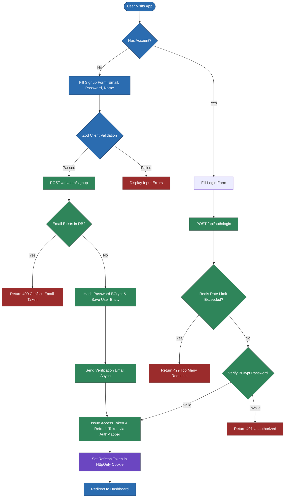
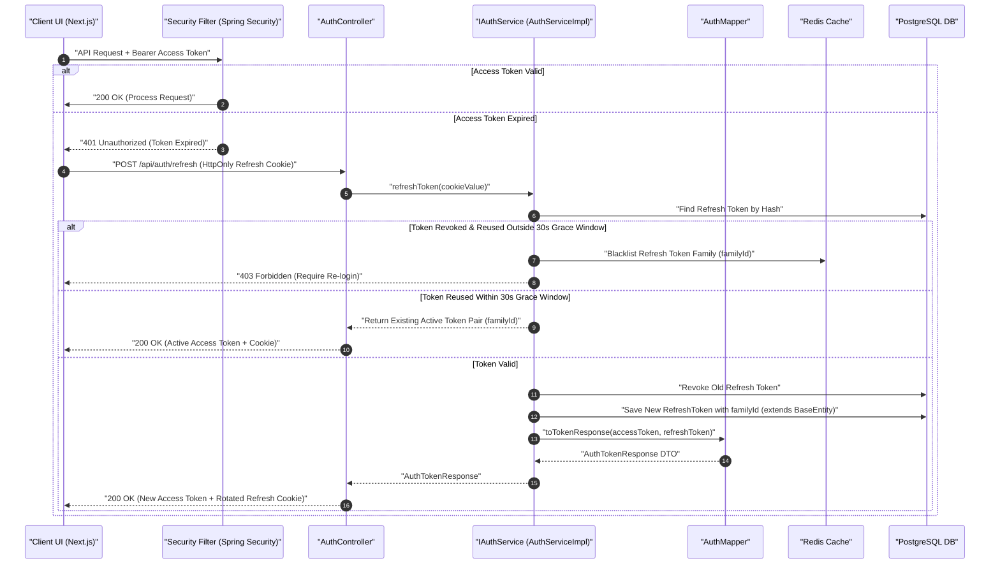
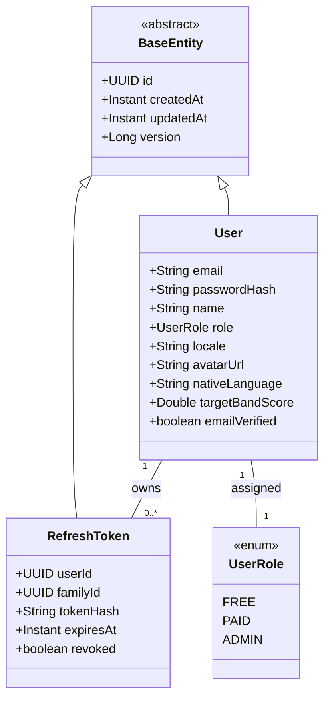

# User Flow & Technical Specifications: Authentication & User Profiles

**Module Scope:** Requirements FR-1.1 through FR-1.12  
**Target Path:** `backend/feature-flows/01-auth-and-user-profile-flow.md`

---

## 1. Executive Summary & Architecture Alignment

The Authentication & User Profile module manages the complete identity lifecycle for the IELTS Platform. It strictly follows the 7-folder module architecture (`entities/`, `repository/`, `dtos/`, `mapper/`, `ports/`, `services/impl/`, `controllers/`), enforces Dependency Inversion (controllers depend strictly on interface ports `IAuthService`, `IUserService`, `IPasswordResetService`), and uses explicit static Mappers (`AuthMapper`, `UserMapper`).

All persisted entities (`User`, `RefreshToken`) extend `com.ieltsplatform.common.base.BaseEntity` (`id` UUID, `createdAt` Instant, `updatedAt` Instant, `version` Long). User profile media management (avatar upload) integrates with the shared kernel `IStorageClient` interface port.

---

## 2. Module Structure & Component Layout

### Auth Module (`com.ieltsplatform.modules.auth`)
- `entities/`: `RefreshToken.java` (extends `BaseEntity`, includes `userId`, `familyId`, `tokenHash`, `expiresAt`, `revoked`)
- `repository/`: `RefreshTokenRepository.java`
- `dtos/`: `SignupRequest.java`, `LoginRequest.java`, `AuthTokenResponse.java`, `RefreshTokenRequest.java`
- `mapper/`: `AuthMapper.java` (static mappings between auth DTOs and entities)
- `ports/`: `IAuthService.java`
- `services/impl/`: `AuthServiceImpl.java` (implements `IAuthService`, interacts with `RefreshTokenRepository`, `UserRepository`, `PasswordEncoder`)
- `controllers/`: `AuthController.java` (depends strictly on `IAuthService`)

### User Module (`com.ieltsplatform.modules.user`)
- `entities/`: `User.java` (extends `BaseEntity`), `UserRole.java` (enum)
- `repository/`: `UserRepository.java`
- `dtos/`: `UserProfileResponse.java`, `UpdateProfileRequest.java`
- `mapper/`: `UserMapper.java` (static mappings `toResponse(User entity)` -> `UserProfileResponse`)
- `ports/`: `IUserService.java`, `IPasswordResetService.java`
- `services/impl/`: `UserServiceImpl.java` (injects `IStorageClient` for avatar uploads, `UserMapper`), `PasswordResetServiceImpl.java`
- `controllers/`: `UserController.java` (depends strictly on `IUserService`, `IPasswordResetService`)

---

## 3. Step-by-Step User Flows

### Flow A: Email & Password Sign Up & Email Verification
1. **User Action:** Navigates to `/signup`, fills in Email, Password, Name, and Target Band Score.
2. **Client Validation:** React Hook Form + Zod schema enforces password complexity (min 8 chars, 1 uppercase, 1 number, 1 special character).
3. **API Request:** `POST /api/auth/signup` with `SignupRequest` DTO.
4. **Backend Processing:**
   - `AuthController` receives request and delegates to `IAuthService.signup(request)`.
   - `AuthServiceImpl` checks email uniqueness via `UserRepository.existsByEmail(email)`.
   - Hashes password using BCrypt (`PasswordEncoder`).
   - Persists `User` entity extending `BaseEntity` (`role = UserRole.FREE`).
   - Generates signed email verification token (expires in 24 hours).
   - Triggers transactional email via `JavaMailSender`.
   - Converts entity to DTO using `AuthMapper.toTokenResponse()`.
5. **Response:** `201 Created` returning `AuthTokenResponse` (Access Token + Refresh Token cookie).

### Flow B: User Login & JWT Rotation with Grace Window
1. **User Action:** Enters Email and Password at `/login`.
2. **API Request:** `POST /api/auth/login`.
3. **Backend Processing:**
   - Checks Redis rate limit counter (`auth:ratelimit:{ip}`). If count > 5 within 15 min, return `429 Too Many Requests`.
   - `AuthController` invokes `IAuthService.login(loginRequest)`.
   - Validates credentials via `DaoAuthenticationProvider`.
   - Generates short-lived Access Token (15-min TTL, JWT signed with RSA/HMAC) and long-lived Refresh Token (7-day TTL).
   - Assigns a unique `familyId` (UUID) to link the rotation sequence for this session family.
   - Hashes Refresh Token and persists `RefreshToken` entity extending `BaseEntity` (`userId`, `familyId`, `tokenHash`, `expiresAt`, `revoked`).
4. **Token Rotation & 30-Second Grace Window:**
   - When `/api/auth/refresh` is invoked with an expired Access Token:
     - If the presented Refresh Token is valid and unrevoked, it is marked as revoked, a new `RefreshToken` is created under the same `familyId`, and a new active token pair is issued.
     - **Grace Window Handling:** To handle concurrent SPA requests (e.g., multiple simultaneous API calls triggering parallel token refresh attempts), if a previously rotated Refresh Token is presented within a **30-second grace window** after its rotation, the server returns the existing active token pair issued for that `familyId` rather than flagging it as token reuse theft.
     - If a revoked Refresh Token is presented **after** the 30-second grace window, the server detects false reuse / security breach, immediately revokes all Refresh Tokens associated with that `familyId`, blacklists the family in Redis, and forces full re-authentication (`403 Forbidden`).
5. **Response:** `200 OK` with JSON body `{ accessToken, expiresIn }` and `httpOnly, Secure, SameSite=Strict` cookie containing the Refresh Token mapped via `AuthMapper`.

### Flow C: Profile Update & S3 Avatar Upload
1. **User Action:** Navigates to `/profile`, updates Name, Native Language, or uploads a new Avatar image file.
2. **Client Request:**
   - Profile patch: `PATCH /api/users/me` with `UpdateProfileRequest`.
   - Avatar upload: `POST /api/users/me/avatar` with `multipart/form-data`.
3. **Backend Processing:**
   - Validates JWT from `Authorization: Bearer <token>` header in `SecurityConfig`.
   - `UserController` delegates to `IUserService.updateAvatar(userId, file)`.
   - **Server-Side Magic-Byte MIME Validation:** `UserServiceImpl` inspects the file header bytes (e.g. `89 50 4E 47` for PNG, `FF D8 FF` for JPEG) to verify actual file magic bytes rather than relying solely on the client-declared `Content-Type` header, and verifies max file size (5MB).
   - **Versioned Pathing:** Uploads content to S3 bucket via shared kernel `IStorageClient.upload("avatars/" + userId + "/" + System.currentTimeMillis() + "-" + UUID.randomUUID() + ".png", bytes, contentType)` using versioned pathing to eliminate CDN/browser caching conflicts upon avatar update.
   - `UserServiceImpl` updates `User.avatarUrl` and returns `UserProfileResponse` via `UserMapper.toResponse(user)`.

---

## 4. Visual Architecture & Sequence Diagrams

### Diagram 1.1: User Authentication & Onboarding Journey (Flowchart)

---

### Diagram 1.2: JWT Token Rotation & Authentication Pipeline (Sequence Diagram)

---

### Diagram 1.3: User & Auth Domain Model (UML Class Diagram)

