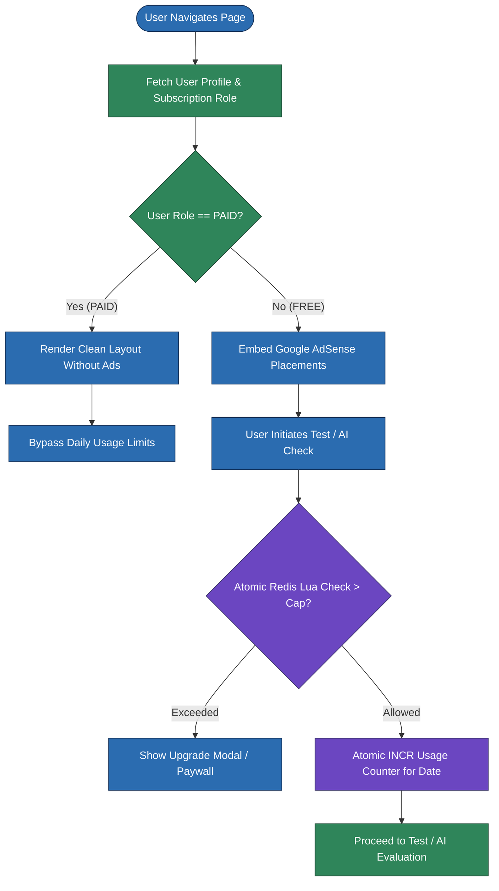
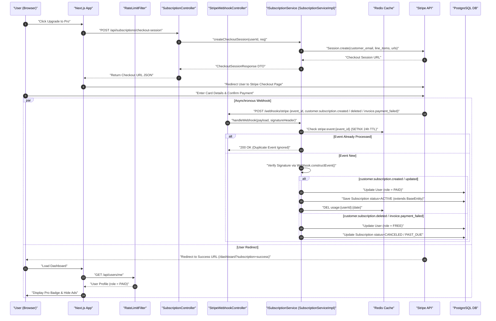
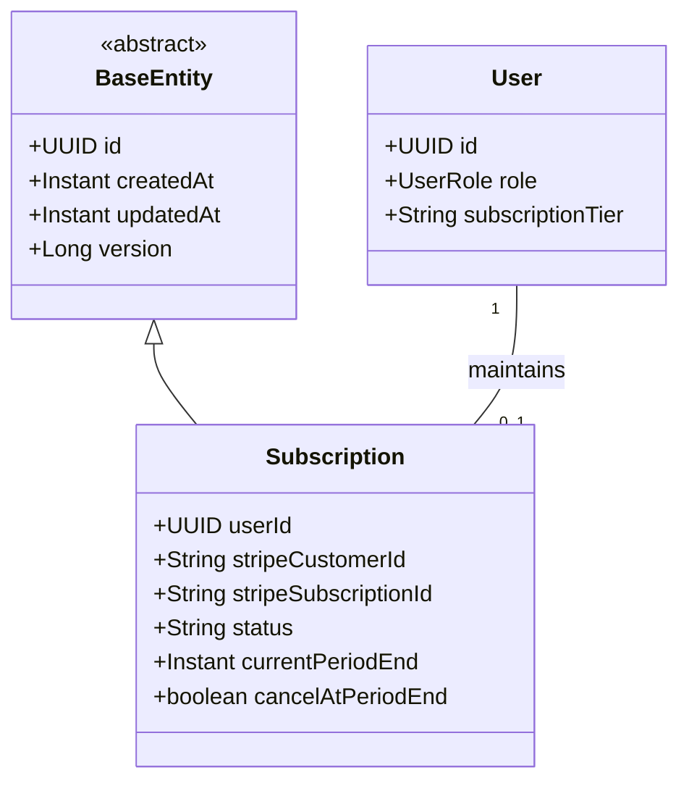

# User Flow & Technical Specifications: Subscriptions & Ad Monetization

**Module Scope:** Requirements FR-2.1 through FR-2.5  
**Target Path:** `backend/feature-flows/02-subscription-and-ads-flow.md`

---

## 1. Executive Summary & Architecture Alignment

The Subscription & Ads module enforces the dual monetization model across the IELTS platform:
1. **Free Tier**: Non-paying users encounter AdSense ad placements on non-test UI routes and have daily attempt limits enforced via atomic Redis counters intercepted by `RateLimitFilter`.
2. **Paid Tier**: Paid subscribers experience zero ads and receive unlimited AI evaluations and test attempts. Subscriptions are created via Stripe Checkout and kept in sync via transactional Stripe webhooks with Redis idempotency checks.

This module strictly adheres to the 7-folder layout (`entities/`, `repository/`, `dtos/`, `mapper/`, `ports/`, `services/impl/`, `controllers/`), Dependency Inversion (`SubscriptionController` depends strictly on interface port `ISubscriptionService`), and explicit static DTO mapping via `SubscriptionMapper`. `Subscription` entity extends `com.ieltsplatform.common.base.BaseEntity`.

---

## 2. Module Structure & Component Layout

### Subscription Module (`com.ieltsplatform.modules.subscription`)
- `entities/`: `Subscription.java` (extends `BaseEntity`)
- `repository/`: `SubscriptionRepository.java`
- `dtos/`: `CheckoutSessionRequest.java`, `CheckoutSessionResponse.java`, `SubscriptionResponse.java`
- `mapper/`: `SubscriptionMapper.java` (static entity to `SubscriptionResponse` DTO mapping)
- `ports/`: `ISubscriptionService.java`
- `services/impl/`: `SubscriptionServiceImpl.java` (Stripe API calls, Redis `event_id` idempotency check, webhook signature validation, updating `User.role` to `PAID`/`FREE`, invalidating Redis usage keys)
- `controllers/`: `SubscriptionController.java` (depends strictly on `ISubscriptionService`), `StripeWebhookController.java`

### Shared Kernel Interceptor
- `RateLimitFilter` (`common/services/impl/RateLimitFilter.java`): Intercepts requests for `FREE` tier users using atomic Redis `INCR` or Lua script on key `usage:{userId}:{date}` to prevent race conditions during concurrent requests.

---

## 3. Step-by-Step User Flows

### Flow A: Upgrade to Paid Tier & Stripe Webhook Lifecycle Handling
1. **User Action:** Clicks "Upgrade to Pro" on pricing page (`/pricing`).
2. **API Request:** `POST /api/subscriptions/checkout-session` with `CheckoutSessionRequest` DTO.
3. **Backend Processing:**
   - `SubscriptionController` receives request and delegates to `ISubscriptionService.createCheckoutSession(userId, request)`.
   - `SubscriptionServiceImpl` calls Stripe API (`Stripe.checkout.Session.create()`).
   - Sets success URL (`/dashboard?subscription=success`) and cancel URL (`/pricing`).
   - Returns `CheckoutSessionResponse` containing Checkout Session ID and Stripe hosted URL mapped via `SubscriptionMapper`.
4. **User Action:** Redirects to Stripe hosted page, completes payment.
5. **Stripe Webhook Processing & Idempotency Check:**
   - Stripe sends event payload to `POST /webhooks/stripe`.
   - `StripeWebhookController` delegates payload and signature header to `ISubscriptionService.handleWebhook(payload, sigHeader)`.
   - **Redis `event_id` Idempotency Check:** Backend checks Redis key `stripe:event:{event_id}` via `SETNX` (with 24-hour TTL). If the event has already been processed, returns `200 OK` immediately to prevent duplicate webhook processing.
   - Backend verifies Stripe signature (`Webhook.constructEvent()`).
   - **Event-Specific Handlers:**
     - `customer.subscription.created` / `customer.subscription.updated` (active status): `SubscriptionServiceImpl` updates `User.role = PAID`, inserts/updates `Subscription` entity extending `BaseEntity` (`stripeCustomerId`, `stripeSubscriptionId`, `status = ACTIVE`, `currentPeriodEnd`), and invalidates Redis daily usage key `usage:{userId}:{date}`.
     - `customer.subscription.deleted`: `SubscriptionServiceImpl` updates `Subscription.status = CANCELED` and reverts `User.role = FREE`.
     - `invoice.payment_failed`: `SubscriptionServiceImpl` updates `Subscription.status = PAST_DUE` and reverts `User.role = FREE`.

### Flow B: Daily Usage Cap Enforcement for Free Tier (Atomic Execution)
1. **User Action:** User attempts to launch a new mock test or AI essay evaluation.
2. **Backend Processing:**
   - `RateLimitFilter` intercepts incoming request before controller execution.
   - Inspects user role from Security Context. If `UserRole.PAID`, bypasses counter check.
   - If `UserRole.FREE`, executes atomic Redis `INCR` or Lua script against key `usage:{userId}:{date}`:
     - Atomically increments key value.
     - On initial key creation (increment value == 1), sets key TTL to expire at midnight (or 24 hours).
     - If returned increment value > 3 (daily cap), throws `DomainException("DAILY_LIMIT_REACHED")` mapped by `GlobalExceptionHandler` to `403 Forbidden`.
     - If returned increment value <= 3, allows request execution to proceed.

---

## 4. Visual Architecture & Sequence Diagrams

### Diagram 2.1: Free vs. Paid Feature Gating & Ad Placement (Flowchart)

---

### Diagram 2.2: Stripe Checkout & Webhook Synchronization (Sequence Diagram)

---

### Diagram 2.3: Subscription & Usage Model (UML Class Diagram)

