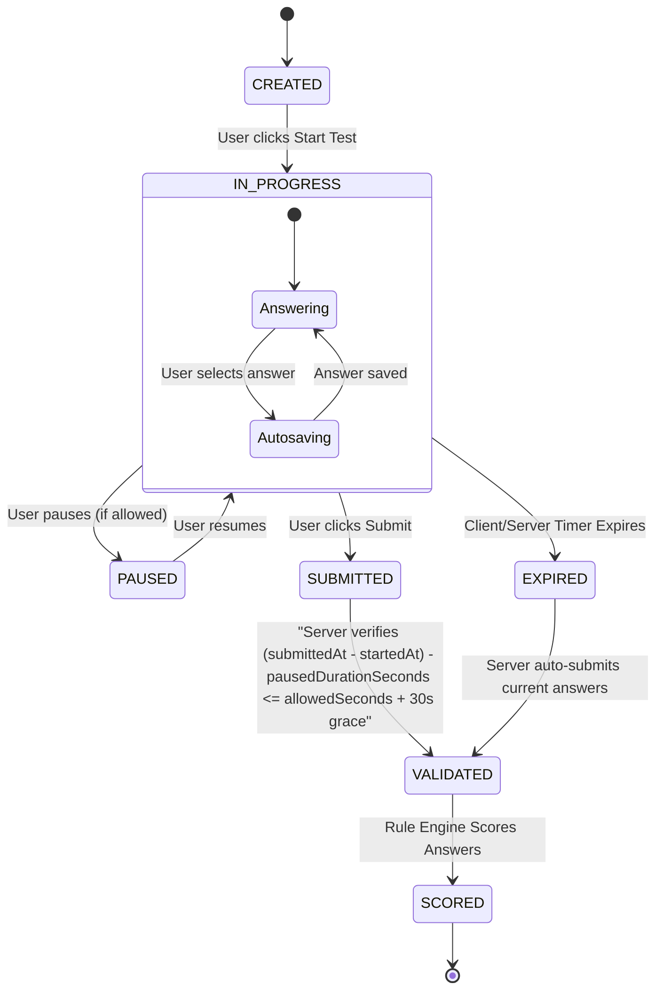
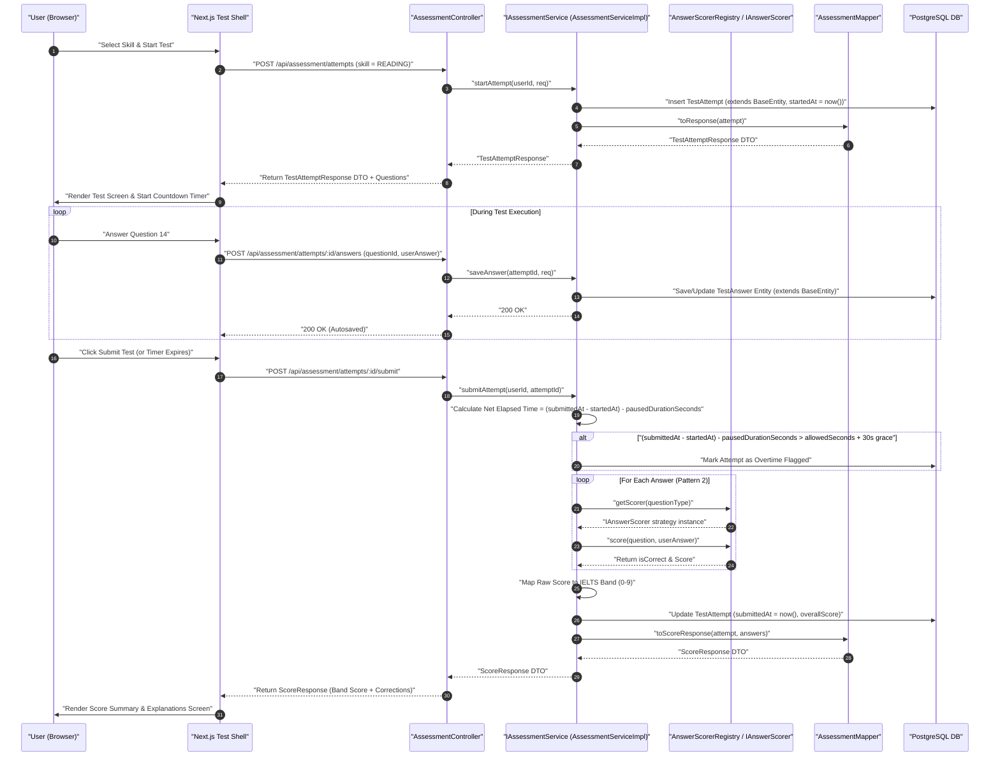
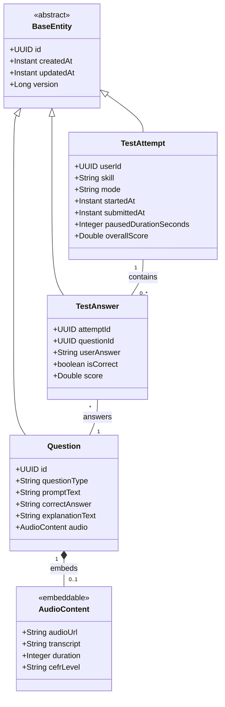

# User Flow & Technical Specifications: IELTS Mock Tests Engine

**Module Scope:** Requirements FR-3.1 through FR-3.18  
**Target Path:** `backend/feature-flows/03-ielts-mock-tests-flow.md`

---

## 1. Executive Summary & Architecture Alignment

The IELTS Mock Tests Engine provides authentic, exam-simulation conditions across all 4 skills (Listening, Reading, Writing, Speaking). It features real-time timers, split-screen reading passage layouts, signed S3 audio streaming via `@Embedded AudioContent` (2-hour presigned URL TTL), automatic rule-based scoring for objective sections via generic `IAnswerScorer` strategies, decoupled AI scoring ports (`IEssayScorer`, `ISpeakingScorer`) for subjective sections, and server-side elapsed time validation (`(submittedAt - startedAt) - pausedDurationSeconds <= allowedSeconds + 30s grace`) to prevent duration tampering.

This module strictly follows the 7-folder layout (`entities/`, `repository/`, `dtos/`, `mapper/`, `ports/`, `services/impl/`, `controllers/`), Dependency Inversion (`AssessmentController` depends strictly on `IAssessmentService`), and explicit static DTO mapping via `AssessmentMapper`. All persistent entities (`TestAttempt`, `TestAnswer`) extend `com.ieltsplatform.common.base.BaseEntity`.

---

## 2. Component Reusability Patterns Applied

- **Pattern 1 (`AudioContent`)**: Listening sections embed `@Embedded AudioContent` (`audioUrl`, `transcript`, `duration`, `cefrLevel`) populated via `ITtsClient` (Cartesia Sonic 3.5) and stored via `IStorageClient` (S3) with presigned URLs issued with a 2-hour TTL so audio does not expire during 40-minute Listening tests.
- **Pattern 2 (`IAnswerScorer`)**: Objective scoring is handled by `AnswerScorerRegistry` (`Map<QuestionType, IAnswerScorer>`) containing `McqScorerImpl`, `TfNgScorerImpl`, and `FillBlankScorerImpl` (Levenshtein edit distance <= 1 permitted ONLY for target words of length >= 4; exact match distance 0 required for target words of length <= 3 to prevent false positives such as `"in"` vs `"on"`). These exact strategy beans are shared with practice drills (`PracticeAttempt`) with zero code duplication.
- **Pattern 6 (Decoupled AI Scoring Ports)**: Writing and Speaking full mock sections delegate evaluation to `IEssayScorer` and `ISpeakingScorer` interface ports (with `Mock*` dev stubs and `Llm*` prod implementations).

---

## 3. Module Structure & Component Layout

### Assessment Module (`com.ieltsplatform.modules.assessment`)
- `entities/`: `TestAttempt.java` (extends `BaseEntity`), `TestAnswer.java` (extends `BaseEntity`), `Question.java`
- `repository/`: `TestAttemptRepository.java`, `TestAnswerRepository.java`, `QuestionRepository.java`
- `dtos/`: `StartAttemptRequest.java`, `SubmitAnswerRequest.java`, `TestAttemptResponse.java`, `ScoreResponse.java`
- `mapper/`: `AssessmentMapper.java` (static mapping between entities and response DTOs)
- `ports/`: `IAssessmentService.java`, `IAnswerScorer.java`
- `services/impl/`: `AssessmentServiceImpl.java` (injects `AnswerScorerRegistry`, `IEssayScorer`, `ISpeakingScorer`), `AnswerScorerRegistry.java`, `McqScorerImpl.java`, `TfNgScorerImpl.java`, `FillBlankScorerImpl.java`
- `controllers/`: `AssessmentController.java` (depends strictly on `IAssessmentService`)

---

## 4. Step-by-Step User Flows

### Flow A: Initiating & Taking a Timed Mock Test
1. **User Action:** Selects a full mock test or individual skill (e.g. Reading Section 1) at `/mock-tests`.
2. **API Request:** `POST /api/assessment/attempts` with `StartAttemptRequest` DTO (`{ skill: "READING" }`).
3. **Backend Processing:**
   - `AssessmentController` delegates to `IAssessmentService.startAttempt(userId, request)`.
   - Validates daily free tier limits via `RateLimitFilter`.
   - Creates `TestAttempt` entity extending `BaseEntity` (`startedAt = now()`, `status = IN_PROGRESS`).
   - For Listening: embeds `@Embedded AudioContent` with 2-hour TTL S3 presigned stream URL so audio does not expire during 40-minute Listening tests.
   - Converts `TestAttempt` entity to `TestAttemptResponse` DTO via `AssessmentMapper.toResponse()`.
4. **Client UI State:**
   - Renders split-screen: left pane displays passage/audio text, right pane displays question form.
   - Launches client-side countdown timer (e.g., 60 minutes).
5. **Autosaving Answers:**
   - As user selects options or types answers, client sends debounced `POST /api/assessment/attempts/{attemptId}/answers` with `SubmitAnswerRequest` DTO.
   - `AssessmentServiceImpl` persists `TestAnswer` entity extending `BaseEntity` linked to `TestAttempt`.

### Flow B: Test Submission & Server-Side Time Validation
1. **User Action / Auto-Submit:** User clicks "Submit Test" or client timer reaches zero.
2. **API Request:** `POST /api/assessment/attempts/{attemptId}/submit`.
3. **Backend Processing:**
   - `AssessmentController` calls `IAssessmentService.submitAttempt(userId, attemptId)`.
   - Sets `submittedAt = now()`.
   - **Server-Side Time Verification Formula:** Calculates net duration: `netElapsedSeconds = (submittedAt - startedAt) - pausedDurationSeconds`. Verifies formula `(submittedAt - startedAt) - pausedDurationSeconds <= allowedSeconds + 30s grace`. If `netElapsedSeconds > allowedSeconds + 30s grace`, flags attempt as expired/overtime.
   - **Generic Scoring Engine Dispatch (Pattern 2)**:
     - For each `TestAnswer`, `AssessmentServiceImpl` looks up matching strategy from `AnswerScorerRegistry` by `QuestionType`:
       - `MCQ`: `McqScorerImpl` (exact option match).
       - `TFNG`: `TfNgScorerImpl` (normalized boolean/string match).
       - `FILL_BLANK`: `FillBlankScorerImpl` (case-insensitive Levenshtein typo-tolerant match <= 1 permitted ONLY for target words of length >= 4; exact match distance 0 required for target words of length <= 3).
     - Subjective sections (Writing / Speaking) delegate to `IEssayScorer` / `ISpeakingScorer` (Pattern 6).
   - Calculates section raw scores and maps raw score to official IELTS Band Score (0.0 - 9.0).
   - Updates `TestAttempt.overallScore` and returns `ScoreResponse` DTO mapped via `AssessmentMapper`.
4. **Response:** Returns `ScoreResponse` DTO with overall band score, per-question breakdown, and text explanations.

---

## 5. Visual Architecture & Sequence Diagrams

### Diagram 3.1: Test Attempt State Machine Diagram

---

### Diagram 3.2: Mock Test Attempt & Server-Side Time Verification (Sequence Diagram)

---

### Diagram 3.3: Mock Test Domain Model (UML Class Diagram)

