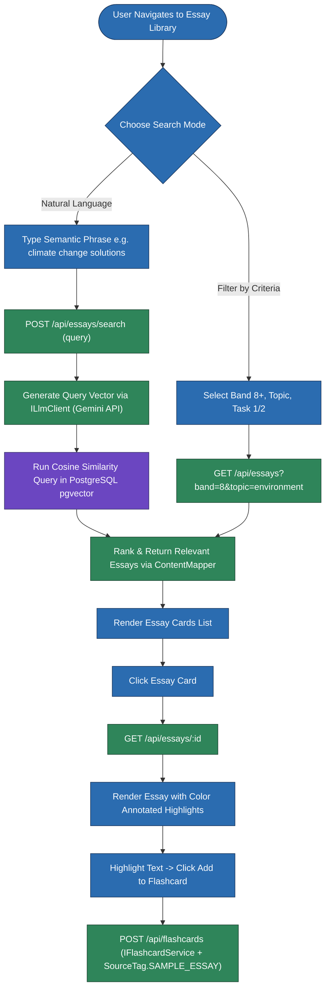
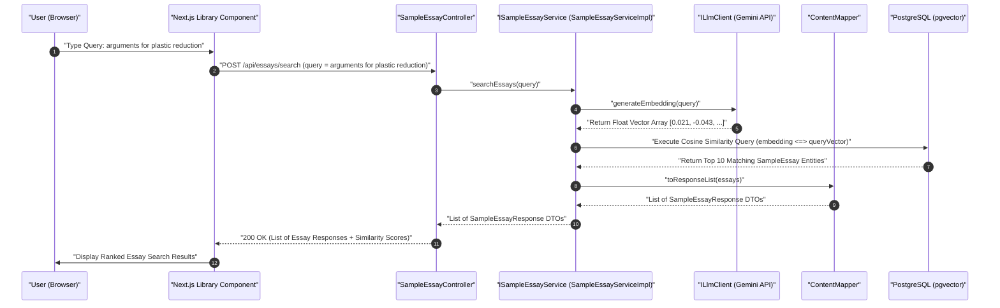
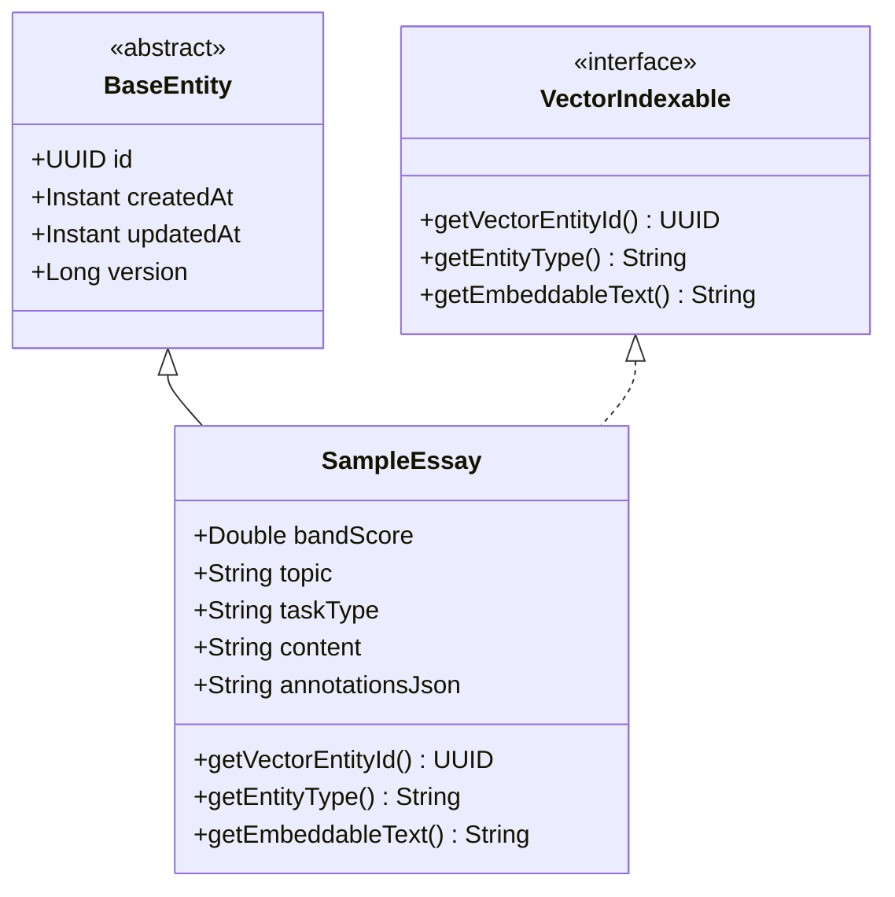

# User Flow & Technical Specifications: Sample Essays Library & Semantic Search

**Module Scope:** Requirements FR-4.1 through FR-4.5  
**Target Path:** `backend/feature-flows/04-sample-essays-library-flow.md`

---

## 1. Executive Summary & Architecture Alignment

The Sample Essays Library allows users to discover, read, and analyze high-scoring (Band 6.0 – 9.0) model IELTS essays. It features multi-attribute filtering (band, topic, task type), natural-language semantic similarity search using PostgreSQL `pgvector` indexed via Google Gemini Embedding API, inline band-score annotations explaining high-scoring phrases, favorites saving, and one-click flashcard extraction.

This module strictly follows the 7-folder layout (`entities/`, `repository/`, `dtos/`, `mapper/`, `ports/`, `services/impl/`, `controllers/`), Dependency Inversion (`SampleEssayController` depends strictly on `ISampleEssayService`), and explicit static DTO mapping via `ContentMapper`. `SampleEssay` entity extends `com.ieltsplatform.common.base.BaseEntity` and implements `VectorIndexable`.

---

## 2. Component Reusability Patterns Applied

- **Pattern 4 (`IFlashcardService`)**: Highlighted phrases in essays can be saved directly to flashcards via `IFlashcardService.addWord(userId, phrase, SourceTag.SAMPLE_ESSAY, essayId)`. This reuses the global `word_definitions` cache to eliminate duplicate LLM definition requests.
- **Pattern 5 (`VectorIndexable`)**: `SampleEssay` implements `VectorIndexable`. Whenever a new sample essay is created, `SampleEssayServiceImpl` publishes a Spring `ContentCreatedEvent`. The `@Async` `VectorIndexingEventListener` annotated with `@TransactionalEventListener(phase = TransactionPhase.AFTER_COMMIT)` executes strictly after transaction commit to eliminate database transaction race conditions when reading saved entities from PostgreSQL. It delegates to `PgVectorEmbeddingIndexerImpl` (`IEmbeddingIndexer`) using `ILlmClient` (Google Gemini Embedding API) to index vector representations into PostgreSQL `pgvector`.

---

## 3. Module Structure & Component Layout

### Content Module (`com.ieltsplatform.modules.content`)
- `entities/`: `SampleEssay.java` (extends `BaseEntity`, implements `VectorIndexable`)
- `repository/`: `SampleEssayRepository.java` (supports `pgvector` cosine similarity queries)
- `dtos/`: `EssaySearchRequest.java`, `SampleEssayResponse.java`
- `mapper/`: `ContentMapper.java` (static entity <-> DTO conversion)
- `ports/`: `ISampleEssayService.java`, `IEmbeddingIndexer.java`, `IFlashcardService.java`
- `services/impl/`: `SampleEssayServiceImpl.java` (publishes `ContentCreatedEvent`, delegates vector search queries to `ILlmClient`), `PgVectorEmbeddingIndexerImpl.java`, `VectorIndexingEventListener.java` (`@Async`, `@TransactionalEventListener(phase = TransactionPhase.AFTER_COMMIT)`)
- `controllers/`: `SampleEssayController.java` (depends strictly on `ISampleEssayService`)

---

## 4. Step-by-Step User Flows

### Flow A: Multi-Attribute Filtering & Semantic Vector Search
1. **User Action:** Navigates to `/essays`.
2. **Keyword & Filter Search:** Filters by Band 8+, Topic ("Environment"), Task Type ("Task 2 Essay").
3. **Semantic Search Query:** Enters a natural-language query like *"how to argue against plastic ban"*.
4. **Backend Processing (`pgvector` Hybrid Search):**
   - `SampleEssayController` receives `POST /api/essays/search` with `EssaySearchRequest` DTO and calls `ISampleEssayService.searchEssays(request)`.
   - `SampleEssayServiceImpl` calls `ILlmClient.generateEmbedding(query)` (Gemini Embedding API) to generate float vector embeddings.
   - Executes PostgreSQL hybrid query in `SampleEssayRepository`:
     ```sql
     SELECT id, topic, band_score, content, (1 - (embedding <=> :query_vector)) AS similarity
     FROM sample_essays
     WHERE band_score >= 8.0 AND topic = 'Environment'
     ORDER BY embedding <=> :query_vector LIMIT 10;
     ```
   - Converts results to `SampleEssayResponse` DTOs via `ContentMapper.toResponse()`.
5. **Response:** Renders ranked list of matching sample essays with relevance similarity scores.

### Flow B: Annotated Essay Reading & Selection-to-Flashcard Extraction
1. **User Action:** Clicks an essay card to view `/essays/{id}`.
2. **UI Rendering:** Renders full essay text with interactive inline highlight annotations (Green = Lexical Resource, Blue = Coherence, Purple = Advanced Grammar).
3. **Copying to Flashcard Deck (Pattern 4):**
   - User selects an advanced phrase (e.g. *"detrimental ramifications"*).
   - Clicks popover button "Add to Flashcards".
   - Client sends request to flashcard endpoint: `POST /api/flashcards`.
   - Backend delegates to `IFlashcardService.addWord(userId, "detrimental ramifications", SourceTag.SAMPLE_ESSAY, essayId)`.
   - `FlashcardServiceImpl` normalizes lemma, checks `WordDefinitionRepository` (`word_definitions` cache table), and persists `Flashcard` entity.

---

## 5. Visual Architecture & Sequence Diagrams

### Diagram 4.1: Essay Discovery & Study Flow (Flowchart)



---

### Diagram 4.2: Hybrid Semantic Vector Search Pipeline (Sequence Diagram)



---

### Diagram 4.3: Sample Essay Domain & Vector Indexing Model (UML Class Diagram)



