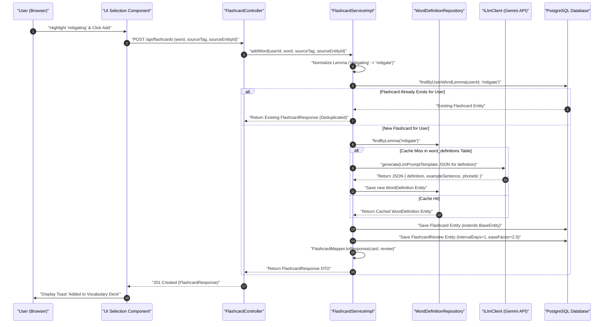
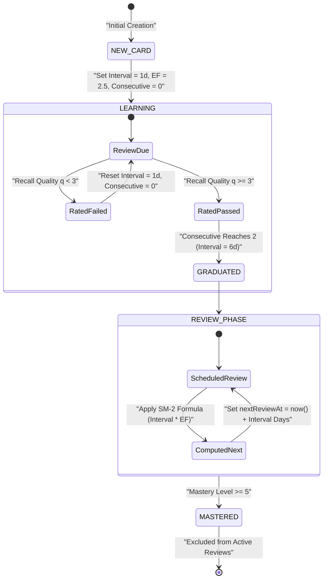
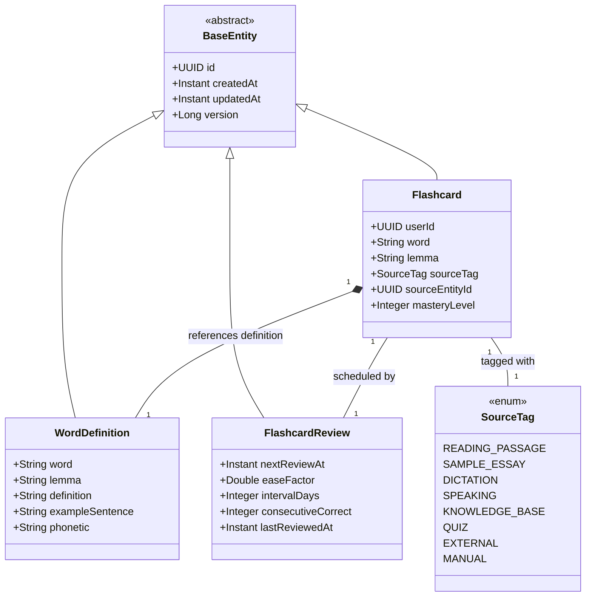

# User Flow & Technical Specifications: Flashcards & SM-2 Spaced Repetition

**Module Scope:** Requirements FR-5.1 through FR-5.9  
**Target Path:** `backend/feature-flows/05-flashcards-spaced-repetition-flow.md`

---

## 1. Executive Summary & User Journey

The Flashcard & Spaced Repetition module acts as a site-wide vocabulary acquisition and retention engine. Users can capture unfamiliar words or phrases from any platform module (reading passages, sample essays, dictations, speaking rooms, knowledge base articles, practice quizzes, external sources, or manual entry). 

To ensure optimal learning and minimize API overhead, the module enforces a **Universal Selection-to-Flashcard Pipeline (Reusability Pattern 4)**:
1. **Lemma Normalization & Deduplication**: Normalizes words to base lemmas (e.g., *"mitigating"* -> *"mitigate"*) to prevent duplicate user flashcards.
2. **Global Definition Caching**: Queries the global `WordDefinition` cache table (`word_definitions`). If missing, it invokes `ILlmClient` (Gemini API adapter) once to generate structured definitions and IELTS-formatted example sentences, sharing results across all users.
3. **SuperMemo-2 (SM-2) Scheduling**: Calculates review intervals based on user recall quality scores (0–5), optimizing retention through automated daily review queues.

---

## 2. Module Architecture & 7-Folder Structure

The module strictly complies with the system 7-folder package layout, enforcing Dependency Inversion (controllers depend strictly on interface ports) and explicit static entity/DTO mappers.

```
backend/src/main/java/com/ieltsplatform/modules/flashcard/
├── controllers/
│   └── FlashcardController.java
├── dtos/
│   ├── AddFlashcardRequest.java
│   ├── FlashcardResponse.java
│   ├── ReviewFlashcardRequest.java
│   └── DueFlashcardsResponse.java
├── entities/
│   ├── Flashcard.java
│   ├── FlashcardReview.java
│   ├── WordDefinition.java
│   └── SourceTag.java
├── mapper/
│   └── FlashcardMapper.java
├── ports/
│   ├── IFlashcardService.java
│   └── ISpacedRepetitionScheduler.java
├── repository/
│   ├── FlashcardRepository.java
│   ├── FlashcardReviewRepository.java
│   └── WordDefinitionRepository.java
└── services/impl/
    ├── FlashcardServiceImpl.java
    └── Sm2SchedulerImpl.java
```

### Shared Kernel Port Dependencies
- `com.ieltsplatform.common.base.BaseEntity`: Abstract base class providing `id` (UUID), `createdAt` (Instant), `updatedAt` (Instant), and `version` (Long).
- `com.ieltsplatform.common.ports.ILlmClient`: LLM interface port backed by `GeminiLlmClientImpl` for AI fallback definition synthesis.

---

## 3. Step-by-Step User Flows

### Flow A: Selection-to-Flashcard Creation with Deduplication & Global Caching
1. **User Action:** Highlights a word (e.g., *"mitigating"*) on any module UI (e.g., Sample Essay or Dictation) and clicks "Add to Flashcards".
2. **API Request:** `POST /api/flashcards` with payload:
   ```json
   {
     "word": "mitigating",
     "sourceTag": "SAMPLE_ESSAY",
     "sourceEntityId": "e3b0c442-98fc-11ee-b9d1-0242ac120002"
   }
   ```
3. **Backend Processing (`FlashcardServiceImpl` implementing `IFlashcardService`):**
   - **Lemma Normalization**: Lowercases word and extracts lemma (`"mitigating"` -> `"mitigate"`).
   - **User Deduplication Check**: Queries `FlashcardRepository.findByUserIdAndLemma(userId, "mitigate")`.
     - *If existing card found*: Updates `sourceTag` / `sourceEntityId` if changed, returns mapped `FlashcardResponse` to prevent card duplication.
   - **Global Definition Cache Lookup & Concurrent Race Condition Handling**:
     - Uses Spring `@Cacheable(value = "word_definitions", key = "#lemma")` with a Redis mutex lock on `WordDefinitionRepository` lookup to prevent concurrent duplicate LLM call race conditions when multiple users attempt to add the same un-cached word simultaneously.
     - *Cache Hit*: Reuses cached `WordDefinition` entity (definition, phonetics, IELTS example sentence) without invoking LLM.
     - *Cache Miss*: Calls `ILlmClient.generate()` using `LlmPromptTemplate` instructing Gemini to output JSON with definition and example sentence. Persists new `WordDefinition` row in `word_definitions` table.
     - *Concurrency Fallback*: If concurrent threads attempt to persist duplicate `WordDefinition` entities for the same lemma simultaneously, `FlashcardServiceImpl` catches `DataIntegrityViolationException` (thrown by database unique index `idx_word_def_lemma`) gracefully and falls back to `WordDefinitionRepository.findByLemma(lemma)` to retrieve the entity inserted by the winning thread, ensuring non-blocking execution.
   - **Entity Persistence**: Constructs `Flashcard` entity and linked `FlashcardReview` entity (`intervalDays = 1`, `easeFactor = 2.5`, `consecutiveCorrect = 0`, `nextReviewAt = Instant.now()`).
   - **DTO Mapping**: Converts entity graph using static `FlashcardMapper.toResponse(flashcard, review)`.
4. **Response:** `201 Created` with `FlashcardResponse` DTO.

### Flow B: Daily Spaced-Repetition Review Queue & SM-2 Calculation
1. **User Action:** Navigates to `/flashcards/review` deck.
2. **API Request:** `GET /api/flashcards/due`.
3. **Backend Query:** `FlashcardReviewRepository.findByUserIdAndNextReviewAtBefore(userId, Instant.now())`.
4. **Review Interaction & SM-2 Calculation:**
   - User reviews prompt, flips card to check definition, and rates recall quality $q \in \{0, 1, 2, 3, 4, 5\}$.
   - Client submits `POST /api/flashcards/{id}/review` with `{ "recallQuality": 4 }`.
   - **SM-2 Engine (`Sm2SchedulerImpl` implementing `ISpacedRepetitionScheduler`):**
     - Adjusts Ease Factor:
       $$EF' = \max\left(1.3, EF + (0.1 - (5 - q) \times (0.08 + (5 - q) \times 0.02))\right)$$
     - Calculates new interval $I_{new}$:
       - If $q < 3$ (Failed recall): $I_{new} = 1$, `consecutiveCorrect = 0`.
       - If $q \ge 3$ (Successful recall):
         - `consecutiveCorrect == 0` -> $I_{new} = 1$
         - `consecutiveCorrect == 1` -> $I_{new} = 6$
         - `consecutiveCorrect >= 2` -> $I_{new} = \text{round}(I_{prev} \times EF')$
         - Increments `consecutiveCorrect`.
     - **Mastery Level & State Transition Logic (`Sm2SchedulerImpl`)**:
       - Updates `masteryLevel` based on recall quality $q$:
         - If $q \ge 4$: Increments `masteryLevel` (`masteryLevel = Math.min(5, masteryLevel + 1)`).
         - If $q < 3$: Decrements `masteryLevel` (`masteryLevel = Math.max(0, masteryLevel - 1)`).
       - When `masteryLevel` reaches 5 ($\ge 5$), the flashcard transitions state to `MASTERED` and is excluded from active daily review queues (`findByUserIdAndNextReviewAtBefore` filters out mastered cards).
     - Sets `nextReviewAt = Instant.now().plus(I_{new}, DAYS)` and updates `lastReviewedAt`.
   - Saves updated `FlashcardReview` entity. Returns `FlashcardResponse` DTO.

---

## 4. Domain Models & Component Specifications

### 4.1 Entities & Enums

#### `SourceTag.java` (Enum)
```java
public enum SourceTag {
    READING_PASSAGE,
    SAMPLE_ESSAY,
    DICTATION,
    SPEAKING,
    KNOWLEDGE_BASE,
    QUIZ,
    EXTERNAL,
    MANUAL
}
```

#### `WordDefinition.java`
```java
@Entity
@Table(name = "word_definitions", indexes = {
    @Index(name = "idx_word_def_lemma", columnList = "lemma", unique = true)
})
public class WordDefinition extends BaseEntity {

    @Column(nullable = false, unique = true)
    private String word;

    @Column(nullable = false)
    private String lemma;

    @Column(columnDefinition = "TEXT", nullable = false)
    private String definition;

    @Column(columnDefinition = "TEXT")
    private String exampleSentence;

    @Column(length = 100)
    private String phonetic;
    
    // Getters, setters, constructors
}
```

#### `Flashcard.java`
```java
@Entity
@Table(name = "flashcards", indexes = {
    @Index(name = "idx_flashcard_user_lemma", columnList = "user_id, lemma", unique = true)
})
public class Flashcard extends BaseEntity {

    @Column(name = "user_id", nullable = false)
    private UUID userId;

    @Column(nullable = false)
    private String word;

    @Column(nullable = false)
    private String lemma;

    @Enumerated(EnumType.STRING)
    @Column(name = "source_tag", nullable = false)
    private SourceTag sourceTag;

    @Column(name = "source_entity_id")
    private UUID sourceEntityId;

    @Column(name = "mastery_level", nullable = false)
    private Integer masteryLevel = 0; // 0 (New) to 5 (Mastered)

    @ManyToOne(fetch = FetchType.LAZY)
    @JoinColumn(name = "word_definition_id", nullable = false)
    private WordDefinition wordDefinition;

    // Getters, setters, constructors
}
```

#### `FlashcardReview.java`
```java
@Entity
@Table(name = "flashcard_reviews")
public class FlashcardReview extends BaseEntity {

    @OneToOne(fetch = FetchType.LAZY, optional = false)
    @JoinColumn(name = "flashcard_id", nullable = false, unique = true)
    private Flashcard flashcard;

    @Column(name = "next_review_at", nullable = false)
    private Instant nextReviewAt;

    @Column(name = "ease_factor", nullable = false)
    private Double easeFactor = 2.5;

    @Column(name = "interval_days", nullable = false)
    private Integer intervalDays = 1;

    @Column(name = "consecutive_correct", nullable = false)
    private Integer consecutiveCorrect = 0;

    @Column(name = "last_reviewed_at")
    private Instant lastReviewedAt;

    // Getters, setters, constructors
}
```

### 4.2 Explicit Static Mapper (`FlashcardMapper.java`)

```java
public final class FlashcardMapper {

    private FlashcardMapper() {}

    public static FlashcardResponse toResponse(Flashcard card, FlashcardReview review) {
        if (card == null) return null;
        WordDefinition def = card.getWordDefinition();
        return new FlashcardResponse(
            card.getId(),
            card.getUserId(),
            card.getWord(),
            card.getLemma(),
            def != null ? def.getDefinition() : null,
            def != null ? def.getExampleSentence() : null,
            def != null ? def.getPhonetic() : null,
            card.getSourceTag(),
            card.getSourceEntityId(),
            card.getMasteryLevel(),
            review != null ? review.getNextReviewAt() : null,
            review != null ? review.getEaseFactor() : 2.5,
            review != null ? review.getIntervalDays() : 1,
            card.getCreatedAt(),
            card.getUpdatedAt()
        );
    }
}
```

---

## 5. Visual Architecture & Diagrams

### Diagram 5.1: Flashcard Creation & Universal Caching Pipeline (Sequence Diagram)



---

### Diagram 5.2: SM-2 Spaced Repetition Engine Lifecycle (State Machine Diagram)



---

### Diagram 5.3: Flashcard Domain Class Diagram (UML Class Diagram)



---

## 6. Reusability Patterns Summary

- **Pattern 4 (Universal Selection-to-Flashcard Pipeline)**: Implements centralized word ingestion, lemma normalization, deduplication, and `word_definitions` cache sharing across Reading, Writing, Dictation, Speaking, Knowledge Base, and Quizzes.
- **Pattern 3 (Structured AI Prompt Template)**: Leverages `ILlmClient` (Gemini API) and `LlmPromptTemplate` for fallback definition generation when cache miss occurs.
