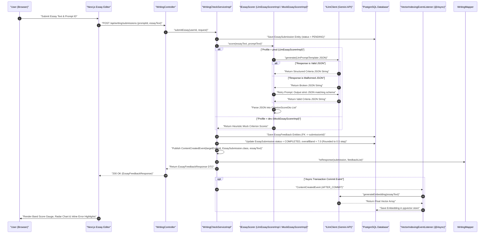
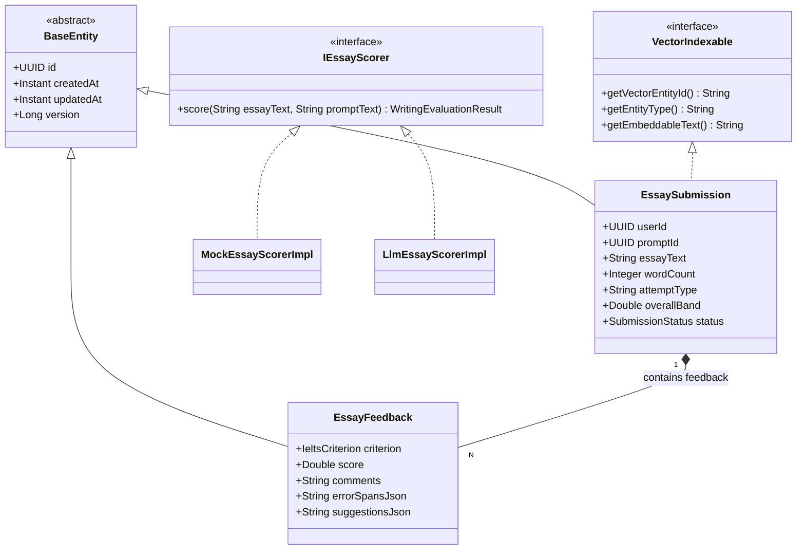

# User Flow & Technical Specifications: Writing Check AI Evaluation

**Module Scope:** Requirements FR-6.1 through FR-6.5  
**Target Path:** `backend/feature-flows/06-writing-check-ai-flow.md`

---

## 1. Executive Summary & User Journey

The Writing Check AI Evaluation Engine allows students to submit Task 1 or Task 2 IELTS essays for automated evaluation and score breakdown. It processes essay submissions through a decoupled evaluation pipeline:

1. **Decoupled AI Scoring Port (Reusability Pattern 6)**: The service layer depends strictly on the `IEssayScorer` interface port, supported by dual implementations:
   - `MockEssayScorerImpl` (`@Profile("dev")`): A deterministic heuristic mock adapter for offline development and fast unit testing.
   - `LlmEssayScorerImpl` (`@Profile("prod")`): A production AI evaluation engine powered by `ILlmClient` (Gemini API adapter).
2. **Structured AI Prompt Pipeline (Reusability Pattern 3)**: Formulates structured JSON prompts using `LlmPromptTemplate` to parse typed criteria scores (Task Response, Coherence & Cohesion, Lexical Resource, Grammatical Range & Accuracy), inline error spans, and improvement suggestions.
3. **Event-Driven Vector Indexing (Reusability Pattern 5)**: `EssaySubmission` extends `BaseEntity` and implements `VectorIndexable`. Upon transaction commit, a lightweight `ContentCreatedEvent` carrying the target entity UUID (`targetEntityId`), entity class type (`entityClass`), and embeddable text (`embeddableText`) triggers asynchronous vector embedding generation (`PgVectorEmbeddingIndexerImpl`) into PostgreSQL `pgvector`, eliminating `LazyInitializationException` risks in `@Async` listeners.
4. **Universal Vocabulary Extraction (Reusability Pattern 4)**: Users can highlight vocabulary from essays or feedback to create flashcards tagged with `SourceTag.SAMPLE_ESSAY`.

---

## 2. Module Architecture & 7-Folder Structure

The module strictly follows the system 7-folder structure, separating interface contracts (`ports/`) from concrete services (`services/impl/`) and utilizing explicit static mappers.

```
backend/src/main/java/com/ieltsplatform/modules/writing/
├── controllers/
│   └── WritingController.java
├── dtos/
│   ├── EssaySubmissionRequest.java
│   ├── EssayFeedbackResponse.java
│   ├── CriterionScoreDto.java
│   └── ErrorSpanDto.java
├── entities/
│   ├── EssaySubmission.java
│   └── EssayFeedback.java
├── mapper/
│   └── WritingMapper.java
├── ports/
│   ├── IWritingCheckService.java
│   └── IEssayScorer.java
├── repository/
│   ├── EssaySubmissionRepository.java
│   └── EssayFeedbackRepository.java
└── services/impl/
    ├── WritingCheckServiceImpl.java
    ├── MockEssayScorerImpl.java
    └── LlmEssayScorerImpl.java
```

### Shared Kernel Contracts
- `com.ieltsplatform.common.base.BaseEntity`: Abstract base class providing `id` (UUID), `createdAt` (Instant), `updatedAt` (Instant), and `version` (Long).
- `com.ieltsplatform.common.base.VectorIndexable`: Interface enabling event-driven vector indexing.
- `com.ieltsplatform.common.events.ContentCreatedEvent`: Application event published upon essay save.
- `com.ieltsplatform.common.listeners.VectorIndexingEventListener`: `@EventListener @Async` handler for `PgVectorEmbeddingIndexerImpl`.
- `com.ieltsplatform.common.ports.ILlmClient`: Gemini API adapter port.
- `com.ieltsplatform.modules.flashcard.ports.IFlashcardService`: Vocabulary extraction service port.

---

## 3. Step-by-Step User Flows

### Flow A: Submitting an Essay & Automated AI Evaluation
1. **User Action:** Types or pastes an essay at `/writing/practice` or submits from a mock test session.
2. **API Request:** `POST /api/writing/submissions` with payload:
   ```json
   {
     "promptId": "a1b2c3d4-0000-0000-0000-123456789abc",
     "essayText": "The bar chart illustrates the percentage of energy generated from renewable sources in four countries...",
     "attemptType": "PRACTICE"
   }
   ```
3. **Backend Processing (`WritingCheckServiceImpl`):**
   - **Validation & Rate Limit**: Verifies daily quota via `RateLimitFilter` / Redis counter.
   - **Persistence**: Constructs and saves `EssaySubmission` entity with `status = PENDING`.
   - **Scoring Delegation**: Invokes `IEssayScorer.score(essayText, promptText)`.
     - *Dev Profile*: `MockEssayScorerImpl` returns instant heuristic band scores.
     - *Prod Profile*: `LlmEssayScorerImpl` builds structured JSON prompt via `LlmPromptTemplate` and calls `ILlmClient.generate(prompt)`.
     - **Fault-Tolerant JSON Parsing (Pattern 3)**: Parses JSON output into DTOs. If JSON is malformed, retries once with explicit JSON instructions; if second attempt fails, throws `DomainException("AI_EVALUATION_FAILED")`.
   - **Feedback Persistence & Overall Band Calculation**: Maps criteria scores (`TASK_ACHIEVEMENT` for Task 1 or `TASK_RESPONSE` for Task 2, alongside `COHERENCE_COHESION`, `LEXICAL_RESOURCE`, `GRAMMATICAL_RANGE`) and inline error spans to `EssayFeedback` entities linked to `EssaySubmission`. Updates submission `status = COMPLETED` and calculates `overallBand` using standard IELTS overall band score rounding logic: computes the unrounded average of the 4 criteria scores $A = \frac{\text{sum of 4 criteria}}{4.0}$, then rounds to the nearest 0.5 step via `Math.round(A * 2.0) / 2.0` (e.g., 6.125 -> 6.0, 6.25 -> 6.5, 6.75 -> 7.0, 6.875 -> 7.0).
   - **Event-Driven Vector Indexing (Pattern 5)**: Publishes `ContentCreatedEvent(targetEntityId, EssaySubmission.class, essayText)`. Carrying the entity UUID and entity class type instead of a detached entity reference eliminates `LazyInitializationException` risks in `@Async` `@TransactionalEventListener(phase = AFTER_COMMIT)` handlers when `VectorIndexingEventListener` asynchronously calls `PgVectorEmbeddingIndexerImpl` using `ILlmClient.generateEmbedding()` to store vector embeddings in `pgvector`.
   - **DTO Mapping**: Calls `WritingMapper.toResponse(submission, feedbackList)`.
4. **Response:** `200 OK` returning `EssayFeedbackResponse` DTO.
5. **Client UI State:** Renders split-screen view with overall band gauge, criteria radar chart, interactive text editor with inline error spans, and improvement suggestions.

### Flow B: Highlighting Essay Vocabulary for Flashcard Extraction
1. **User Action:** User selects an advanced phrase (e.g., *"renewable sources"*) in the essay editor and clicks "Add to Flashcards".
2. **API Request:** Delegated to `IFlashcardService.addWord(userId, "renewable sources", SourceTag.SAMPLE_ESSAY, submissionId)`.
3. **Backend Processing:** Normalizes lemma, checks `word_definitions` cache, and creates flashcard card tagged with `SourceTag.SAMPLE_ESSAY`.

---

## 4. Domain Models & Component Specifications

### 4.1 Entities & Enums

#### `EssaySubmission.java`
```java
@Entity
@Table(name = "essay_submissions")
public class EssaySubmission extends BaseEntity implements VectorIndexable {

    @Column(name = "user_id", nullable = false)
    private UUID userId;

    @Column(name = "prompt_id", nullable = false)
    private UUID promptId;

    @Column(name = "essay_text", columnDefinition = "TEXT", nullable = false)
    private String essayText;

    @Column(name = "word_count", nullable = false)
    private Integer wordCount;

    @Column(name = "attempt_type", nullable = false, length = 20)
    private String attemptType; // "MOCK_TEST" or "PRACTICE"

    @Column(name = "overall_band")
    private Double overallBand;

    @Enumerated(EnumType.STRING)
    @Column(nullable = false, length = 20)
    private SubmissionStatus status = SubmissionStatus.PENDING;

    // VectorIndexable Contract Implementation
    @Override
    public String getVectorEntityId() {
        return getId().toString();
    }

    @Override
    public String getEntityType() {
        return "ESSAY_SUBMISSION";
    }

    @Override
    public String getEmbeddableText() {
        return essayText;
    }

    public enum SubmissionStatus { PENDING, COMPLETED, FAILED }

    // Getters, setters, constructors
}
```

#### `EssayFeedback.java`
```java
@Entity
@Table(name = "essay_feedbacks")
public class EssayFeedback extends BaseEntity {

    @ManyToOne(fetch = FetchType.LAZY, optional = false)
    @JoinColumn(name = "submission_id", nullable = false)
    private EssaySubmission submission;

    @Enumerated(EnumType.STRING)
    @Column(nullable = false, length = 30)
    private IeltsCriterion criterion;

    @Column(nullable = false)
    private Double score;

    @Column(columnDefinition = "TEXT")
    private String comments;

    @Column(name = "error_spans_json", columnDefinition = "TEXT")
    private String errorSpansJson;

    @Column(name = "suggestions_json", columnDefinition = "TEXT")
    private String suggestionsJson;

    public enum IeltsCriterion {
        TASK_RESPONSE,    // Used for Task 2 essays
        TASK_ACHIEVEMENT, // Used for Task 1 essays
        COHERENCE_COHESION,
        LEXICAL_RESOURCE,
        GRAMMATICAL_RANGE
    }

    // Getters, setters, constructors
}
```

### 4.2 Explicit Static Mapper (`WritingMapper.java`)

```java
public final class WritingMapper {

    private WritingMapper() {}

    public static EssayFeedbackResponse toResponse(EssaySubmission submission, List<EssayFeedback> feedbacks) {
        if (submission == null) return null;
        List<CriterionScoreDto> criterionDtos = feedbacks.stream()
            .map(f -> new CriterionScoreDto(
                f.getCriterion().name(),
                f.getScore(),
                f.getComments(),
                f.getErrorSpansJson(),
                f.getSuggestionsJson()
            ))
            .collect(Collectors.toList());

        return new EssayFeedbackResponse(
            submission.getId(),
            submission.getPromptId(),
            submission.getOverallBand(),
            submission.getWordCount(),
            submission.getStatus().name(),
            criterionDtos,
            submission.getCreatedAt()
        );
    }
}
```

---

## 5. Visual Architecture & Diagrams

### Diagram 6.1: AI Essay Evaluation & Vector Indexing Sequence Diagram



---

### Diagram 6.2: Writing AI Pipeline Component Architecture

```mermaid
graph TD
    classDef client fill:#2B6CB0,stroke:#1A365D,color:#FFFFFF
    classDef backend fill:#2F855A,stroke:#1C4532,color:#FFFFFF
    classDef external fill:#C05621,stroke:#7B341E,color:#FFFFFF
    classDef storage fill:#6B46C1,stroke:#3C366B,color:#FFFFFF

    Sub["Client Submission"] --> Ctrl[WritingController]
    Ctrl --> Svc[WritingCheckServiceImpl]
    
    Svc --> DB1[('PostgreSQL: essay_submissions')]
    Svc --> ScorerPort['IEssayScorer Interface Port']

    ScorerPort -- '@Profile('dev')' --> DevScorer[MockEssayScorerImpl]
    ScorerPort -- '@Profile('prod')' --> ProdScorer[LlmEssayScorerImpl]

    ProdScorer --> Prompt['LlmPromptTemplate Builder']
    Prompt --> LLMClient['ILlmClient (Gemini API)']
    LLMClient --> Gemini['Google Gemini API']

    Gemini --> Parser{'Jackson JSON Schema Parser'}
    Parser -- 'Success' --> DB2[('PostgreSQL: essay_feedbacks')]
    Parser -- 'Parse Error' --> Retry['Retry Strategy: Max 1 Retry']
    Retry --> LLMClient

    Svc -- 'ContentCreatedEvent(UUID, Class, String)' --> EventBus['Spring Event Publisher']
    EventBus -- '@TransactionalEventListener' --> AsyncIndexer['VectorIndexingEventListener']
    AsyncIndexer --> PgVector['PgVectorEmbeddingIndexerImpl']
    PgVector --> DB3[('PostgreSQL: pgvector store')]

    DB2 --> ResBuilder[WritingMapper]
    ResBuilder --> UI['Render UI Highlights & Band Breakdown']

    class Sub,UI client;
    class Ctrl,Svc,ScorerPort,DevScorer,ProdScorer,Prompt,LLMClient,Parser,Retry,EventBus,AsyncIndexer,PgVector,ResBuilder backend;
    class Gemini external;
    class DB1,DB2,DB3 storage;
```

---

### Diagram 6.3: Writing Domain Class Diagram (UML Class Diagram)



---

## 6. Reusability Patterns Summary

- **Pattern 3 (Structured AI Prompt Template)**: Prompts Gemini API using strict JSON schema output requirements with Jackson mapping and automatic retry handling.
- **Pattern 4 (Universal Vocabulary Pipeline)**: Integrates with `IFlashcardService` for saving essay vocabulary tagged with `SourceTag.SAMPLE_ESSAY`.
- **Pattern 5 (Event-Driven Vector Search Indexing)**: Implements `VectorIndexable`, publishing `ContentCreatedEvent` for async `pgvector` indexing after transaction commit.
- **Pattern 6 (Decoupled AI Scoring Port)**: Controller and business service interact strictly with the `IEssayScorer` interface port, cleanly isolating dev mock adapters (`MockEssayScorerImpl`) from prod AI models (`LlmEssayScorerImpl`).
