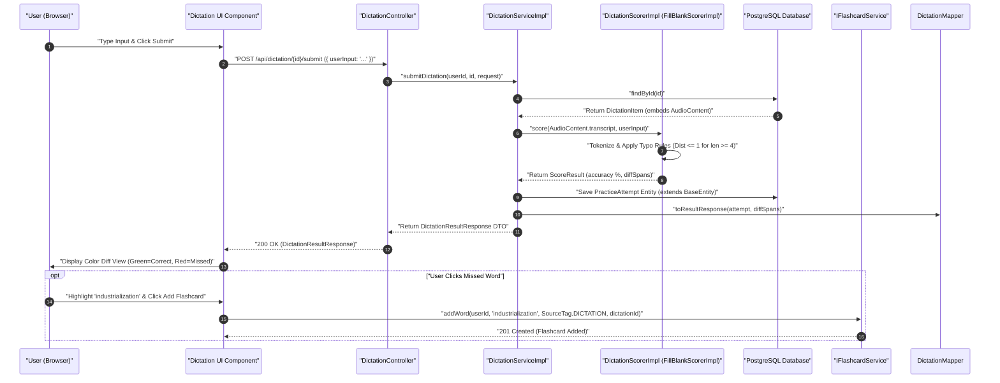
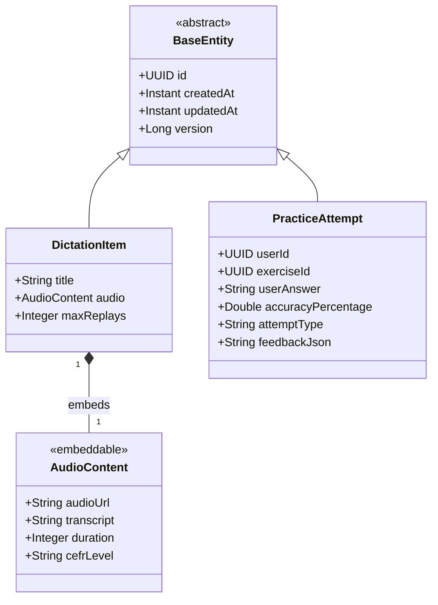

# User Flow & Technical Specifications: Dictation Exercises

**Module Scope:** Requirements FR-7.1 through FR-7.6  
**Target Path:** `backend/feature-flows/07-dictation-exercises-flow.md`

---

## 1. Executive Summary & User Journey

The Dictation Exercises module enhances listening comprehension, phonetic transcription, and spelling precision. Users select listening passages categorized by CEFR level (A1–C2), listen to audio synthesized via native-accented Text-to-Speech engines, type spoken text word-for-word, and submit their transcript for instant evaluation.

Key architectural features include:
1. **Audio Content Embeddable & TTS Pipeline (Reusability Pattern 1)**: Embeds `@Embedded AudioContent` (`audioUrl`, `transcript`, `duration`, `cefrLevel`), powered by `ITtsClient` (Cartesia Sonic 3.5 API adapter) and `IStorageClient` (S3/MinIO storage adapter).
2. **Generic Answer Scoring Engine (Reusability Pattern 2)**: Evaluates dictation transcripts using `DictationScorerImpl`, which reuses the typo-tolerant `FillBlankScorerImpl` strategy from `AnswerScorerRegistry` (Levenshtein distance $\le 1$ for word length $\ge 4$; exact distance $= 0$ for length $\le 3$). Submissions are recorded as `PracticeAttempt` entities extending `BaseEntity`.
3. **Universal Vocabulary Pipeline (Reusability Pattern 4)**: Enables single-click addition of missed or misspelled dictation words to user flashcards tagged with `SourceTag.DICTATION`, leveraging global `word_definitions` cache lookup.

---

## 2. Module Architecture & 7-Folder Structure

The module strictly adheres to the 7-folder package layout, enforcing Dependency Inversion (controllers depend strictly on interface ports) and explicit static entity/DTO mappers.

```
backend/src/main/java/com/ieltsplatform/modules/dictation/
├── controllers/
│   └── DictationController.java
├── dtos/
│   ├── DictationItemResponse.java
│   ├── DictationSubmitRequest.java
│   ├── DictationResultResponse.java
│   └── DiffSpanDto.java
├── entities/
│   ├── DictationItem.java
│   └── PracticeAttempt.java
├── mapper/
│   └── DictationMapper.java
├── ports/
│   ├── IDictationService.java
│   └── IDictationScorer.java
├── repository/
│   ├── DictationItemRepository.java
│   └── PracticeAttemptRepository.java
└── services/impl/
    ├── DictationServiceImpl.java
    └── DictationScorerImpl.java
```

### Shared Kernel Dependencies
- `com.ieltsplatform.common.base.BaseEntity`: Base class providing `id` (UUID), `createdAt` (Instant), `updatedAt` (Instant), and `version` (Long).
- `com.ieltsplatform.common.embeddables.AudioContent`: `@Embeddable` class encapsulating audio media metadata.
- `com.ieltsplatform.common.ports.ITtsClient`: Cartesia TTS engine adapter port (`CartesiaTtsClientImpl`).
- `com.ieltsplatform.common.ports.IStorageClient`: AWS S3 audio media storage adapter port (`S3StorageClientImpl`).
- `com.ieltsplatform.common.ports.IAnswerScorer`: Shared scoring strategy interface (`FillBlankScorerImpl`).
- `com.ieltsplatform.modules.flashcard.ports.IFlashcardService`: Vocabulary selection-to-flashcard port (`FlashcardServiceImpl`).

---

## 3. Step-by-Step User Flows

### Flow A: Dictation Session Initialization & Audio Delivery
1. **User Action:** Selects CEFR level (e.g., B2) and dictation item at `/dictation`.
2. **API Request:** `GET /api/dictation/{id}`.
3. **Backend Processing (`DictationServiceImpl`):**
   - Fetches `DictationItem` entity.
   - If `@Embedded AudioContent` audio URL is missing, invokes `ITtsClient.synthesize(transcript, voiceId)` via Cartesia Sonic 3.5, uploads generated MP3 bytes via `IStorageClient.upload()`, and updates `AudioContent`.
   - Returns mapped `DictationItemResponse` via `DictationMapper.toItemResponse(item, storageClient)`, which generates an S3 presigned GET URL via `IStorageClient.presignedUrl(audioUrl)` when serializing `@Embedded AudioContent` into the DTO response.
4. **Client UI State:** Renders custom audio player with variable playback speed toggles (`1.0x`, `0.75x`, `0.5x`), replay counter tracking remaining plays, and live typing text area.

### Flow B: Submission & Word-Level Diff Evaluation
1. **User Action:** Types transcript into editor and clicks "Submit Dictation".
2. **API Request:** `POST /api/dictation/{id}/submit` with payload:
   ```json
   {
     "userInput": "The environment is under severe pressure due to industrialization..."
   }
   ```
3. **Backend Processing (`DictationServiceImpl` & `DictationScorerImpl`):**
   - Fetches `DictationItem` entity containing ground-truth `AudioContent.transcript`.
   - **Scoring Delegation (`DictationScorerImpl` reusing `FillBlankScorerImpl`)**:
     - Tokenizes ground-truth transcript and user input.
     - Compares token sequences using word-level Levenshtein distance matrix.
     - **Typo Tolerance Rules (Pattern 2)**:
       - Token length $\ge 4$: Levenshtein distance $\le 1$ classified as `MATCH` (or minor typo).
       - Token length $\le 3$: Exact distance $= 0$ required for `MATCH`.
     - Categorizes word tokens into diff spans: `MATCH`, `MISSED`, `INCORRECT`, `EXTRA`.
     - Calculates accuracy score percentage using denominator `totalWords = max(transcriptWords.length, userWords.length)` to prevent extra user words from inflating accuracy scores:
       $$\text{Accuracy \%} = \frac{\text{MATCH count}}{\max(\text{transcriptWords.length}, \text{userWords.length})} \times 100$$
   - **Persistence**: Records exercise outcome as a `PracticeAttempt` entity extending `BaseEntity` with `exerciseId`, `userAnswer`, `accuracyPercentage`, and serialized diff JSON.
   - **DTO Mapping**: Converts attempt and diff spans via static `DictationMapper.toResultResponse(attempt, diffSpans)`.
4. **Response:** `200 OK` with `DictationResultResponse` DTO.
5. **Client UI State:** Renders side-by-side correction view with color-coded diff highlights (Green = Correct, Red Strikethrough = Missed/Misspelled, Yellow = Extra). Clicking any missed word invokes `IFlashcardService.addWord(userId, word, SourceTag.DICTATION, dictationId)`.

---

## 4. Domain Models & Component Specifications

### 4.1 Entities & Embeddables

#### `AudioContent.java` (`@Embeddable`)
```java
@Embeddable
public class AudioContent {

    @Column(name = "audio_url", nullable = false)
    private String audioUrl;

    @Column(columnDefinition = "TEXT", nullable = false)
    private String transcript;

    @Column(name = "duration_seconds")
    private Integer duration;

    @Column(name = "cefr_level", length = 10)
    private String cefrLevel;

    // Getters, setters, constructors
}
```

#### `DictationItem.java`
```java
@Entity
@Table(name = "dictation_items")
public class DictationItem extends BaseEntity {

    @Column(nullable = false)
    private String title;

    @Embedded
    private AudioContent audio;

    @Column(name = "max_replays", nullable = false)
    private Integer maxReplays = 3;

    // Getters, setters, constructors
}
```

#### `PracticeAttempt.java`
```java
@Entity
@Table(name = "practice_attempts")
public class PracticeAttempt extends BaseEntity {

    @Column(name = "user_id", nullable = false)
    private UUID userId;

    @Column(name = "exercise_id", nullable = false)
    private UUID exerciseId;

    @Column(name = "user_answer", columnDefinition = "TEXT")
    private String userAnswer;

    @Column(name = "accuracy_percentage")
    private Double accuracyPercentage;

    @Column(name = "attempt_type", nullable = false, length = 30)
    private String attemptType; // "DICTATION", "READING_DRILL", etc.

    @Column(name = "feedback_json", columnDefinition = "TEXT")
    private String feedbackJson;

    // Getters, setters, constructors
}
```

### 4.2 Explicit Static Mapper (`DictationMapper.java`)

```java
public final class DictationMapper {

    private DictationMapper() {}

    public static DictationItemResponse toItemResponse(DictationItem item, IStorageClient storageClient) {
        if (item == null) return null;
        AudioContent audio = item.getAudio();
        String presignedAudioUrl = (audio != null && audio.getAudioUrl() != null)
            ? storageClient.presignedUrl(audio.getAudioUrl())
            : null;
        return new DictationItemResponse(
            item.getId(),
            item.getTitle(),
            presignedAudioUrl,
            audio != null ? audio.getCefrLevel() : null,
            item.getMaxReplays(),
            audio != null ? audio.getDuration() : 0
        );
    }

    public static DictationResultResponse toResultResponse(PracticeAttempt attempt, List<DiffSpanDto> diffSpans) {
        if (attempt == null) return null;
        return new DictationResultResponse(
            attempt.getId(),
            attempt.getExerciseId(),
            attempt.getAccuracyPercentage(),
            diffSpans,
            attempt.getCreatedAt()
        );
    }
}
```

---

## 5. Visual Architecture & Diagrams

### Diagram 7.1: Dictation User Journey & Diff Evaluation (Flowchart)

```mermaid
graph TD
    classDef client fill:#2B6CB0,stroke:#1A365D,color:#FFFFFF
    classDef backend fill:#2F855A,stroke:#1C4532,color:#FFFFFF
    classDef storage fill:#6B46C1,stroke:#3C366B,color:#FFFFFF

    Start([User Navigates to Dictation]) --> SelectLevel["Select CEFR Level A1-C2"]
    SelectLevel --> FetchItem["GET /api/dictation/{id}"]
    FetchItem --> SvcAudioCheck{"Audio URL Exists in AudioContent?"}

    SvcAudioCheck -- "No (Synthesize)" --> Cartesia["ITtsClient (Cartesia Sonic 3.5)"]
    Cartesia --> S3Upload["IStorageClient (S3 Storage)"]
    S3Upload --> UpdateAudio["Update DictationItem.audioUrl"]
    UpdateAudio --> RenderPlayer

    SvcAudioCheck -- "Yes" --> RenderPlayer["Render Audio Player & Typing Input"]

    RenderPlayer --> PlayAudio["Play Audio & Adjust Speed 0.75x / 0.5x"]
    PlayAudio --> TypeText["Type Transcribed Words into TextArea"]
    TypeText --> ReplayCheck{"Remaining Replays > 0?"}
    ReplayCheck -- "Yes" --> PlayAudio
    ReplayCheck -- "No" --> Submit["Click Submit Dictation"]

    Submit --> ReqSubmit["POST /api/dictation/{id}/submit"]
    ReqSubmit --> Scorer["DictationScorerImpl (FillBlankScorerImpl Strategy)"]
    Scorer --> Levenshtein["Compute Word-Level Levenshtein Matrix"]

    Levenshtein --> RuleCheck{"Word Length >= 4?"}
    RuleCheck -- "Yes" --> TolCheck["Distance <= 1 counts as MATCH"]
    RuleCheck -- "No" --> ExactCheck["Exact Distance == 0 required for MATCH"]

    TolCheck --> Categorize["Categorize: MATCH, MISSED, INCORRECT, EXTRA"]
    ExactCheck --> Categorize
    Categorize --> SaveAttempt["Save PracticeAttempt Entity (extends BaseEntity)"]

    SaveAttempt --> ReturnRes["Return DictationResultResponse DTO"]
    ReturnRes --> RenderDiff["Render Color-Coded Diff View"]
    RenderDiff --> FlashcardAdd["Click Missed Word -> IFlashcardService.addWord(SourceTag.DICTATION)"]

    class Start,SelectLevel,RenderPlayer,PlayAudio,TypeText,ReplayCheck,Submit,RenderDiff,FlashcardAdd client;
    class FetchItem,SvcAudioCheck,Cartesia,S3Upload,UpdateAudio,ReqSubmit,Scorer,Levenshtein,RuleCheck,TolCheck,ExactCheck,Categorize,SaveAttempt,ReturnRes backend;
```



---

### Diagram 7.2: Word-Level Diff Evaluation Sequence Diagram



---

### Diagram 7.3: Dictation Domain Class Diagram (UML Class Diagram)



---

## 6. Reusability Patterns Summary

- **Pattern 1 (Audio Content & TTS Pipeline Reuse)**: Embeds `@Embedded AudioContent`, managed by `ITtsClient` (Cartesia Sonic 3.5) and `IStorageClient` (AWS S3).
- **Pattern 2 (Generic Answer Scoring Engine)**: `DictationScorerImpl` reuses the typo-tolerant `FillBlankScorerImpl` strategy for objective evaluation, recording results as `PracticeAttempt` entities.
- **Pattern 4 (Universal Selection-to-Flashcard Pipeline)**: Integrates with `IFlashcardService` for saving missed dictation vocabulary tagged with `SourceTag.DICTATION`.
