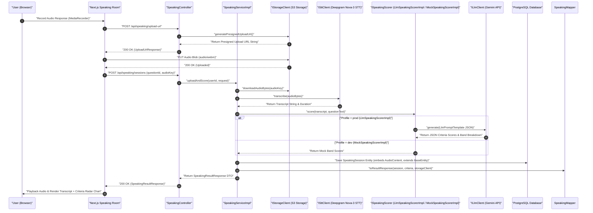
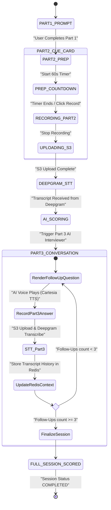
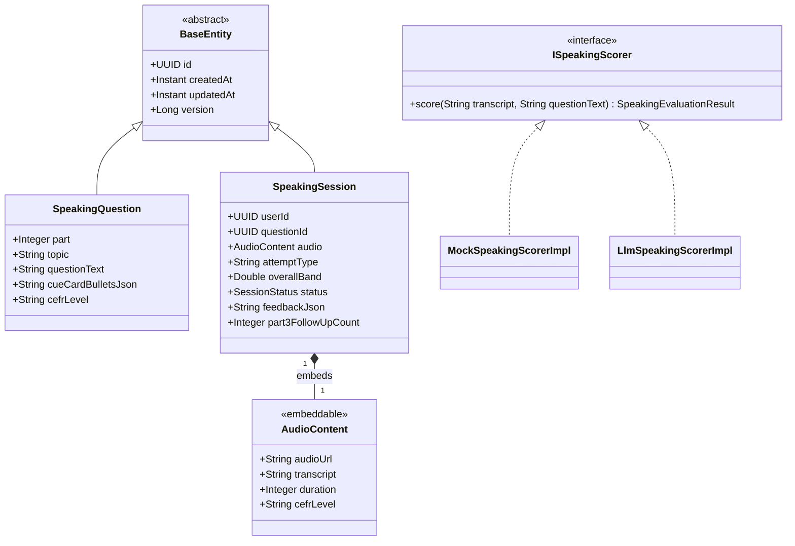

# User Flow & Technical Specifications: Speaking Practice Room & Shadowing

**Module Scope:** Requirements FR-8.1 through FR-8.7  
**Target Path:** `backend/feature-flows/08-speaking-practice-room-flow.md`

---

## 1. Executive Summary & User Journey

The Speaking Practice Room simulates authentic IELTS Speaking tests (Parts 1, 2, and 3) and sentence shadowing drills. Users record their responses directly in the browser via the `MediaRecorder` API, upload audio files to AWS S3 using presigned URLs, receive automated speech-to-text transcription and criteria scoring, and participate in an interactive Part 3 conversational loop with an AI interviewer.

Key architectural features include:
1. **Audio Content & STT/TTS Pipeline (Reusability Pattern 1)**: Embeds `@Embedded AudioContent` (`audioUrl`, `transcript`, `duration`, `cefrLevel`), powered by `IStorageClient` (AWS S3 storage adapter), `ISttClient` (Deepgram Nova-3 API adapter for transcription), and `ITtsClient` (Cartesia Sonic 3.5 API adapter for AI interviewer voice synthesis).
2. **Structured AI Prompt Evaluation (Reusability Pattern 3)**: Formulates structured prompts using `LlmPromptTemplate` for score breakdown across the 4 IELTS criteria: *Fluency & Coherence, Lexical Resource, Grammatical Range & Accuracy, and Pronunciation*.
3. **Universal Vocabulary Pipeline (Reusability Pattern 4)**: Highlighted transcript phrases are added to flashcards tagged with `SourceTag.SPEAKING`, reusing global `word_definitions` cache definitions.
4. **Decoupled AI Scoring Port (Reusability Pattern 6)**: Services depend strictly on the `ISpeakingScorer` interface port, supporting `MockSpeakingScorerImpl` (`@Profile("dev")`) for offline testing and `LlmSpeakingScorerImpl` (`@Profile("prod")`) for live evaluation.

---

## 2. Module Architecture & 7-Folder Structure

The module strictly complies with the system 7-folder package layout, separating interface ports from implementation classes and utilizing explicit static mappers.

```
backend/src/main/java/com/ieltsplatform/modules/speaking/
├── controllers/
│   └── SpeakingController.java
├── dtos/
│   ├── UploadUrlResponse.java
│   ├── SpeakingSubmissionRequest.java
│   ├── SpeakingResultResponse.java
│   ├── SpeakingCriteriaDto.java
│   └── FollowUpQuestionResponse.java
├── entities/
│   ├── SpeakingSession.java
│   └── SpeakingQuestion.java
├── mapper/
│   └── SpeakingMapper.java
├── ports/
│   ├── ISpeakingService.java
│   └── ISpeakingScorer.java
├── repository/
│   ├── SpeakingSessionRepository.java
│   └── SpeakingQuestionRepository.java
└── services/impl/
    ├── SpeakingServiceImpl.java
    ├── MockSpeakingScorerImpl.java
    └── LlmSpeakingScorerImpl.java
```

### Shared Kernel Contracts
- `com.ieltsplatform.common.base.BaseEntity`: Base class providing `id` (UUID), `createdAt` (Instant), `updatedAt` (Instant), and `version` (Long).
- `com.ieltsplatform.common.embeddables.AudioContent`: `@Embeddable` class encapsulating audio URL, transcript, duration, and CEFR level.
- `com.ieltsplatform.common.ports.IStorageClient`: AWS S3 audio media storage adapter port (`S3StorageClientImpl`).
- `com.ieltsplatform.common.ports.ISttClient`: Deepgram Nova-3 Speech-to-Text adapter port (`DeepgramSttClientImpl`).
- `com.ieltsplatform.common.ports.ITtsClient`: Cartesia Sonic 3.5 Text-to-Speech adapter port (`CartesiaTtsClientImpl`).
- `com.ieltsplatform.common.ports.ILlmClient`: Gemini API adapter port (`GeminiLlmClientImpl`).
- `com.ieltsplatform.modules.flashcard.ports.IFlashcardService`: Selection-to-flashcard port (`FlashcardServiceImpl`).

---

## 3. Step-by-Step User Flows

### Flow A: Audio Capture, Presigned Upload, Deepgram STT & AI Scoring
1. **User Action:** Selects Speaking Question (e.g., Part 2 Cue Card) at `/speaking/room`.
2. **Prep Time Countdown:** Client launches a 60-second prep countdown timer for Part 2.
3. **Audio Recording:** User clicks "Record", speaks into microphone; browser records an `audio/webm` blob via `MediaRecorder`.
4. **S3 Presigned URL Upload:**
   - Client requests `POST /api/speaking/upload-url` -> backend calls `IStorageClient.generatePresignedUploadUrl("speaking/" + userId + "/" + UUID.randomUUID() + ".webm")`.
   - Client uploads raw audio blob directly to S3 via HTTP `PUT`.
5. **API Evaluation Request:** Client calls `POST /api/speaking/sessions` with payload:
   ```json
   {
     "questionId": "c4d5e6f7-1111-2222-3333-444455556666",
     "audioKey": "speaking/user-123/session-456.webm",
     "attemptType": "PRACTICE"
   }
   ```
6. **Backend Processing (`SpeakingServiceImpl` & `ISpeakingScorer`):**
   - **Server-Side Audio Key Path Validation**: Validates that `audioKey` matches the strict pattern `audio/speaking/{userId}/*` (e.g., starts with `audio/speaking/` + `userId` + `/`). If `audioKey` does not match the authenticated user's ID path, the request is immediately rejected with `403 Forbidden` / `DomainException("INVALID_AUDIO_KEY_ACCESS")` to prevent cross-user key hijacking.
   - **Audio Fetch & Speech-to-Text**: Fetches audio bytes from S3 (`IStorageClient`), calls `ISttClient.transcribe(audioBytes)` via Deepgram Nova-3 API adapter -> receives transcript string, word-level confidence scores, and audio duration.
   - **Scoring Delegation (`ISpeakingScorer`)**:
     - *Dev Profile*: `MockSpeakingScorerImpl` returns deterministic mock band scores based on transcript word count.
     - *Prod Profile*: `LlmSpeakingScorerImpl` uses `LlmPromptTemplate` to prompt Gemini (`ILlmClient`) for criteria breakdown.
     - **Prompt Strategy & Multimodal Heuristics (`LlmSpeakingScorerImpl`)**:
       - *Lexical Resource*: Analyzes transcript text for IELTS vocabulary sophistication, collocations, idiomatic phrasing, and topic density via Gemini LLM.
       - *Grammatical Range & Accuracy*: Analyzes transcript sentence complexity, compound/complex clause ratio, and grammatical errors via Gemini LLM.
       - *Fluency & Coherence*: Combines Gemini LLM text cohesion analysis with audio metadata: total audio duration and word count (words per minute, WPM) serve as heuristics for speaking pace, hesitations, and silence pauses.
       - *Pronunciation*: Evaluates Deepgram Nova-3 STT word-level confidence scores as a proxy heuristic for pronunciation clarity and articulation precision.
   - **Persistence**: Constructs `SpeakingSession` entity extending `BaseEntity`, embeds `@Embedded AudioContent` (`audioUrl`, `transcript`, `duration`, `cefrLevel`), and saves entity.
   - **DTO Mapping**: Converts entity graph using static `SpeakingMapper.toResultResponse(session, criteriaDtos, storageClient)`, generating an S3 presigned GET URL via `IStorageClient.presignedUrl(audioUrl)` when serializing `@Embedded AudioContent` into the DTO response.
7. **Response:** `200 OK` returning `SpeakingResultResponse` DTO with audio playback URL, verbatim transcript, and band scores.

### Flow B: Dynamic Part 3 Conversational Follow-Up Loop
1. **Trigger:** User completes Part 2 cue card or preceding Part 3 answer.
2. **Backend Context & AI Interviewer Generation (`SpeakingServiceImpl`):**
   - Updates session state in Redis (`speaking:session:{sessionId}`).
   - Calls `ILlmClient.generate()` asking Gemini for an IELTS Part 3 follow-up question based on transcript history.
   - Calls `ITtsClient.synthesize(followUpText, voiceId)` via Cartesia Sonic 3.5 to generate native AI interviewer voice MP3 bytes. Uploads audio to S3 (`IStorageClient`).
   - Increments `part3FollowUpCount`.
3. **Response:** Returns `FollowUpQuestionResponse` DTO containing question text and presigned audio URL.
4. **Client UI State:** Plays AI interviewer voice audio and displays follow-up question card.

---

## 4. Domain Models & Component Specifications

### 4.1 Entities & Enums

#### `SpeakingQuestion.java`
```java
@Entity
@Table(name = "speaking_questions")
public class SpeakingQuestion extends BaseEntity {

    @Column(nullable = false)
    private Integer part; // 1, 2, or 3

    @Column(nullable = false)
    private String topic;

    @Column(name = "question_text", columnDefinition = "TEXT", nullable = false)
    private String questionText;

    @Column(name = "cue_card_bullets_json", columnDefinition = "TEXT")
    private String cueCardBulletsJson;

    @Column(name = "cefr_level", length = 10)
    private String cefrLevel;

    // Getters, setters, constructors
}
```

#### `SpeakingSession.java`
```java
@Entity
@Table(name = "speaking_sessions")
public class SpeakingSession extends BaseEntity {

    @Column(name = "user_id", nullable = false)
    private UUID userId;

    @Column(name = "question_id", nullable = false)
    private UUID questionId;

    @Embedded
    private AudioContent audio;

    @Column(name = "attempt_type", nullable = false, length = 20)
    private String attemptType; // "MOCK_TEST" or "PRACTICE"

    @Column(name = "overall_band")
    private Double overallBand;

    @Enumerated(EnumType.STRING)
    @Column(nullable = false, length = 20)
    private SessionStatus status = SessionStatus.IN_PROGRESS;

    @Column(name = "feedback_json", columnDefinition = "TEXT")
    private String feedbackJson;

    @Column(name = "part3_follow_up_count", nullable = false)
    private Integer part3FollowUpCount = 0;

    public enum SessionStatus { IN_PROGRESS, COMPLETED, FAILED }

    // Getters, setters, constructors
}
```

### 4.2 Explicit Static Mapper (`SpeakingMapper.java`)

```java
public final class SpeakingMapper {

    private SpeakingMapper() {}

    public static SpeakingResultResponse toResultResponse(SpeakingSession session, List<SpeakingCriteriaDto> criteria, IStorageClient storageClient) {
        if (session == null) return null;
        AudioContent audio = session.getAudio();
        String presignedAudioUrl = (audio != null && audio.getAudioUrl() != null)
            ? storageClient.presignedUrl(audio.getAudioUrl())
            : null;
        return new SpeakingResultResponse(
            session.getId(),
            session.getQuestionId(),
            presignedAudioUrl,
            audio != null ? audio.getTranscript() : null,
            session.getOverallBand(),
            session.getStatus().name(),
            criteria,
            session.getCreatedAt()
        );
    }

    public static FollowUpQuestionResponse toFollowUpResponse(String questionText, String rawAudioUrl, IStorageClient storageClient) {
        String presignedAudioUrl = (rawAudioUrl != null) ? storageClient.presignedUrl(rawAudioUrl) : null;
        return new FollowUpQuestionResponse(questionText, presignedAudioUrl);
    }
}
```

---

## 5. Visual Architecture & Diagrams

### Diagram 8.1: Audio Capture, Deepgram STT & AI Scoring Pipeline (Sequence Diagram)



---

### Diagram 8.2: Dynamic Part 3 Conversational Loop (State Machine Diagram)



---

### Diagram 8.3: Speaking Domain Class Diagram (UML Class Diagram)



---

## 6. Reusability Patterns Summary

- **Pattern 1 (Audio Content & STT/TTS Pipeline Reuse)**: Integrates `@Embedded AudioContent` with `IStorageClient` (AWS S3), `ISttClient` (Deepgram Nova-3 STT), and `ITtsClient` (Cartesia Sonic 3.5 TTS for AI interviewer voice).
- **Pattern 3 (Structured AI Prompt Template)**: Prompts Gemini API using `LlmPromptTemplate` for strict JSON formatting of speaking band criteria.
- **Pattern 4 (Universal Vocabulary Pipeline)**: Ingests highlighted transcript vocabulary into user flashcards tagged with `SourceTag.SPEAKING`.
- **Pattern 6 (Decoupled AI Scoring Port)**: Isolates dev stubs (`MockSpeakingScorerImpl`) from production LLM evaluation engines (`LlmSpeakingScorerImpl`) via the `ISpeakingScorer` interface port.
