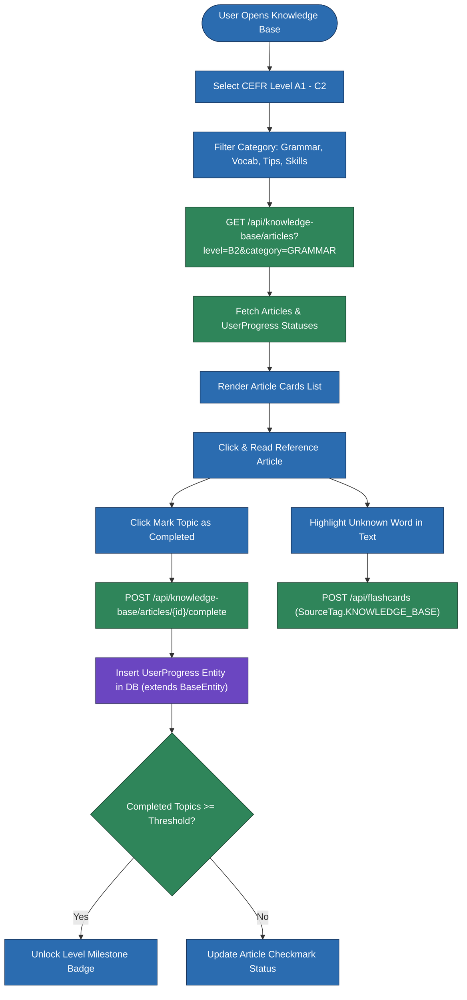
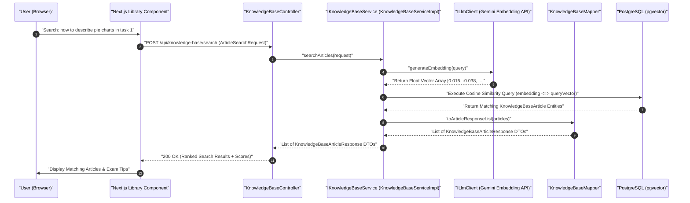
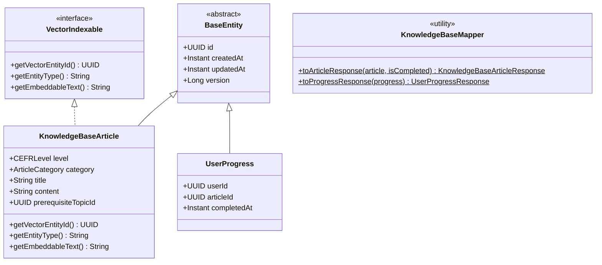

# User Flow & Technical Specifications: CEFR Reference Library & Knowledge Base

**Module Scope:** Requirements FR-9.1 through FR-9.5  
**Target Path:** `backend/feature-flows/09-cefr-reference-library-flow.md`

---

## 1. Executive Summary & Architecture Alignment

The CEFR Reference Library & Knowledge Base acts as a structured learning center categorized by CEFR level (`A1` to `C2`) and topic category (`GRAMMAR`, `VOCABULARY`, `TIPS_TRICKS`, `SKILLS`). It enables students to study level-appropriate grammar rules and vocabulary, track topic completions, unlock milestone achievement badges when completing topic thresholds, perform natural-language semantic searches using PostgreSQL `pgvector`, and extract vocabulary directly into spaced repetition flashcards.

This module strictly adheres to the system 7-folder module structure (`entities/`, `repository/`, `dtos/`, `mapper/`, `ports/`, `services/impl/`, `controllers/`), Dependency Inversion (`KnowledgeBaseController` depends exclusively on `IKnowledgeBaseService`), and explicit static DTO transformation via `KnowledgeBaseMapper`. All domain entities (`KnowledgeBaseArticle`, `UserProgress`) extend `com.ieltsplatform.common.base.BaseEntity`, and indexable content entities implement `com.ieltsplatform.common.base.VectorIndexable`.

---

## 2. Component Reusability Patterns Applied

- **Pattern 4 (`IFlashcardService`)**: Highlighted words or grammar phrases within reference articles can be saved directly to flashcard decks via `IFlashcardService.addWord(userId, word, SourceTag.KNOWLEDGE_BASE, articleId)`. This leverages the global `WordDefinitionRepository` (`word_definitions` cache table) to avoid redundant LLM definition generation calls.
- **Pattern 5 (`VectorIndexable`)**: `KnowledgeBaseArticle` implements `VectorIndexable`. Upon transaction commit when saving or updating articles, `KnowledgeBaseServiceImpl` publishes a Spring `ContentCreatedEvent`. The asynchronous event listener `VectorIndexingEventListener` (`@Async`, `@TransactionalEventListener(phase = TransactionPhase.AFTER_COMMIT)`) delegates to `PgVectorEmbeddingIndexerImpl` (`IEmbeddingIndexer`) using `ILlmClient` (Google Gemini Embedding API) to populate PostgreSQL `pgvector` embeddings for hybrid cosine similarity search.

---

## 3. Module Structure & Component Layout

```
backend/src/main/java/com/ieltsplatform/modules/content/
├── controllers/
│   └── KnowledgeBaseController.java
├── dtos/
│   ├── ArticleSearchRequest.java
│   ├── KnowledgeBaseArticleResponse.java
│   ├── TopicCompletionRequest.java
│   ├── TopicCompletionResponse.java
│   └── UserProgressResponse.java
├── entities/
│   ├── KnowledgeBaseArticle.java
│   └── UserProgress.java
├── mapper/
│   └── KnowledgeBaseMapper.java
├── ports/
│   ├── IKnowledgeBaseService.java
│   ├── IEmbeddingIndexer.java
│   └── IFlashcardService.java
├── repository/
│   ├── KnowledgeBaseArticleRepository.java
│   └── UserProgressRepository.java
└── services/impl/
    └── KnowledgeBaseServiceImpl.java
```

### Shared Kernel Dependencies
- `com.ieltsplatform.common.base.BaseEntity`: Base class providing `id` (UUID), `createdAt` (Instant), `updatedAt` (Instant), and `version` (Long).
- `com.ieltsplatform.common.base.VectorIndexable`: Interface defining `getVectorEntityId()`, `getEntityType()`, and `getEmbeddableText()`.
- `com.ieltsplatform.common.events.ContentCreatedEvent`: Application event published upon article creation/update.
- `com.ieltsplatform.common.listeners.VectorIndexingEventListener`: `@EventListener @Async` handler for indexer execution.
- `com.ieltsplatform.common.ports.ILlmClient`: Gemini API adapter port.
- `com.ieltsplatform.modules.flashcard.ports.IFlashcardService`: Universal flashcard extraction service port.

---

## 4. Domain Models & Specifications

### `KnowledgeBaseArticle.java`
- **Extends**: `BaseEntity`
- **Implements**: `VectorIndexable`
- **Fields**:
  - `level`: `CEFRLevel` enum (`A1`, `A2`, `B1`, `B2`, `C1`, `C2`)
  - `category`: `ArticleCategory` enum (`GRAMMAR`, `VOCABULARY`, `TIPS_TRICKS`, `SKILLS`)
  - `title`: `String`
  - `content`: `String` (Markdown / HTML article body)
  - `prerequisiteTopicId`: `UUID` (nullable, links to mandatory prior article)
- **VectorIndexable Methods**:
  - `getVectorEntityId()` -> returns `getId()`
  - `getEntityType()` -> returns `"KNOWLEDGE_BASE"`
  - `getEmbeddableText()` -> returns `title + " " + content`

### `UserProgress.java`
- **Extends**: `BaseEntity`
- **Fields**:
  - `userId`: `UUID`
  - `articleId`: `UUID`
  - `completedAt`: `Instant`

### `TopicCompletionRequest.java`
- **Fields**:
  - `articleId`: `UUID`

### `KnowledgeBaseMapper.java`
- Static utility mapping entity instances to DTO responses:
  - `toArticleResponse(KnowledgeBaseArticle entity, boolean isCompleted)` -> `KnowledgeBaseArticleResponse`
  - `toProgressResponse(UserProgress entity)` -> `UserProgressResponse`

---

## 5. Step-by-Step User Flows

### Flow A: CEFR Level Navigation, Article Study & Topic Completion
1. **User Action:** Navigates to `/library` and filters by level (e.g. `B2`) and category (`GRAMMAR`).
2. **API Request:** `GET /api/knowledge-base/articles?level=B2&category=GRAMMAR`.
3. **Backend Processing (`KnowledgeBaseServiceImpl`):**
   - Fetches articles for level `B2` and category `GRAMMAR` from `KnowledgeBaseArticleRepository`.
   - Fetches completed article IDs for `userId` from `UserProgressRepository`.
   - Maps entities to `KnowledgeBaseArticleResponse` DTOs via `KnowledgeBaseMapper.toArticleResponse(article, isCompleted)`.
4. **Article Study & Completion:**
   - User reads article (e.g. *"Mastering Mixed Conditionals at B2"*).
   - Clicks **"Mark Topic as Completed"**.
   - Client issues `POST /api/knowledge-base/articles/{id}/complete`.
   - `KnowledgeBaseServiceImpl` checks if `UserProgress` already exists; if absent, creates and saves new `UserProgress` entity (`userId`, `articleId`, `completedAt = Instant.now()`).
   - **Prerequisite & Badge Engine**: Queries total completed topics for level `B2`. If `completedTopics >= threshold` (e.g., 10 topics completed), grants `B2_GRAMMAR_MASTER` milestone badge and unlocks next CEFR level in UI response.

### Flow B: Natural-Language Semantic Vector Search over Knowledge Base
1. **User Action:** Types natural-language query into library search bar: *"how to describe pie charts in task 1"*.
2. **API Request:** `POST /api/knowledge-base/search` with payload `ArticleSearchRequest` (`query = "how to describe pie charts in task 1"`).
3. **Backend Processing (`KnowledgeBaseServiceImpl`):**
   - Invokes `ILlmClient.generateEmbedding(query)` (Google Gemini Embedding API) to get float vector.
   - Executes PostgreSQL hybrid cosine similarity query via centralized `content_embeddings` store (`IEmbeddingIndexer`):
     ```sql
     SELECT entity_id, (1 - (embedding <=> :queryVector)) AS similarity
     FROM content_embeddings
     WHERE entity_type = 'KNOWLEDGE_BASE' AND (1 - (embedding <=> :queryVector)) >= 0.70
     ORDER BY embedding <=> :queryVector
     LIMIT 10;
     ```
   - Fetches matching `KnowledgeBaseArticle` entities by `entity_id` from `KnowledgeBaseArticleRepository` and converts resulting records to `KnowledgeBaseArticleResponse` DTOs with relevance scores.
4. **Response:** Renders ranked list of matching grammar rules and exam tip articles.

### Flow C: Vocabulary Selection to Flashcard Extraction (Pattern 4)
1. **User Action:** Highlights unfamiliar word or idiom while reading an article (e.g. *"ubiquitous"*).
2. **UI Action:** Clicks popover button **"Add to Flashcards"**.
3. **API Request:** `POST /api/flashcards` with payload `{ "word": "ubiquitous", "sourceTag": "KNOWLEDGE_BASE", "sourceEntityId": "article-uuid" }`.
4. **Backend Processing:**
   - Invokes `IFlashcardService.addWord(userId, "ubiquitous", SourceTag.KNOWLEDGE_BASE, articleId)`.
   - `FlashcardServiceImpl` normalizes lemma, queries `WordDefinitionRepository` (`word_definitions` cache table), fetches or generates definition via `ILlmClient`, and saves `Flashcard` entity.

---

## 6. Visual Architecture & Sequence Diagrams

### Diagram 9.1: Knowledge Base Navigation & Progress Unlocks (Flowchart)



---

### Diagram 9.2: Knowledge Base Semantic Vector Search & Event Indexing (Sequence Diagram)



---

### Diagram 9.3: CEFR Reference Library Domain & Vector Model (UML Class Diagram)


