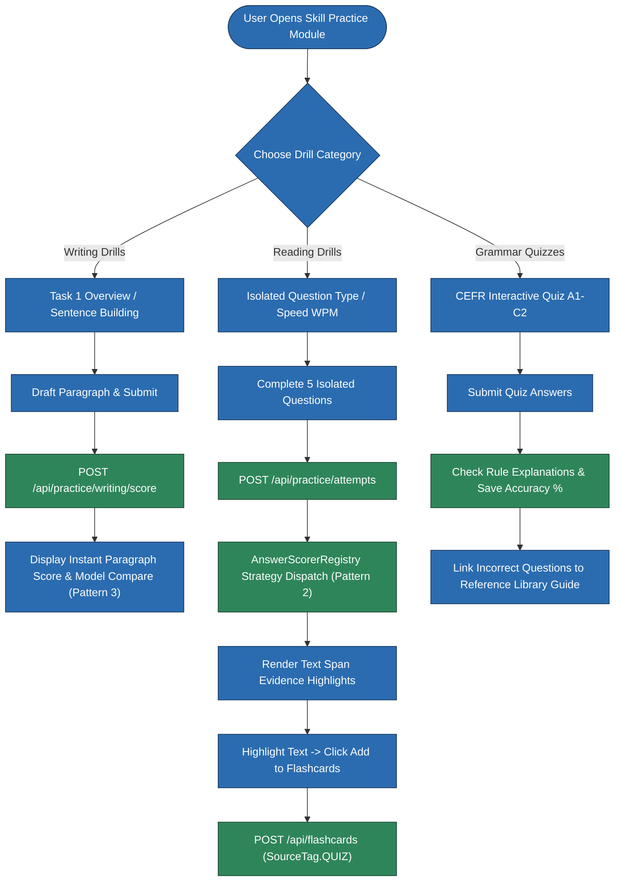
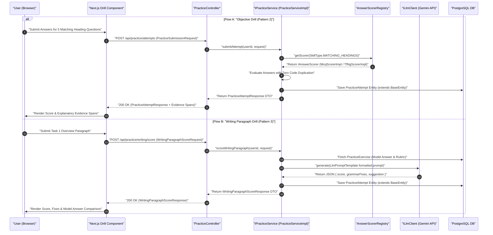
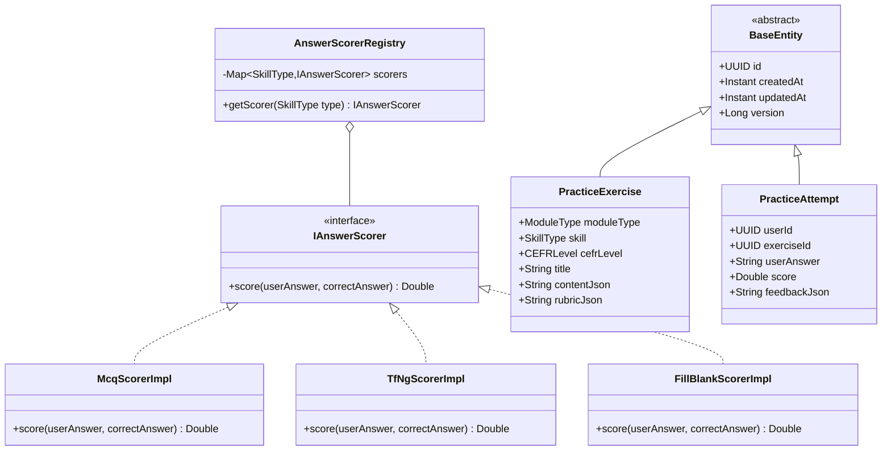

# User Flow & Technical Specifications: Skill Practice & Training Drills

**Module Scope:** Requirements FR-10.1 through FR-12.5  
**Target Path:** `backend/feature-flows/10-skill-practice-drills-flow.md`

---

## 1. Executive Summary & User Journey

The Skill Practice & Training Module provides targeted, untimed micro-exercises distinct from full official IELTS mock tests. It allows students to isolate and strengthen specific skills across:
1. **Objective Reading & Listening Drills** (isolated question types like Matching Headings, True/False/Not Given, Fill-in-Blanks).
2. **Writing Drills** (sentence building, Task 1 chart overview descriptions, Task 2 thesis statements, model comparisons).
3. **Grammar & Vocabulary Quizzes** (CEFR-aligned interactive quizzes linked directly to the Reference Library).

This module strictly implements the system 7-folder module structure (`entities/`, `repository/`, `dtos/`, `mapper/`, `ports/`, `services/impl/`, `controllers/`), Dependency Inversion (`PracticeController` depends strictly on `IPracticeService`), and explicit static DTO mapping via `PracticeMapper` / `AssessmentMapper`. All domain entities (`PracticeExercise`, `PracticeAttempt`) extend `com.ieltsplatform.common.base.BaseEntity`.

---

## 2. Component Reusability Patterns Applied

- **Pattern 2 (`IAnswerScorer` Strategy Registry)**: Objective drill questions (MCQ, T/F/NG, Fill Blank) are evaluated by `PracticeServiceImpl` dispatching to `AnswerScorerRegistry` (`Map<SkillType, IAnswerScorer>`), reusing `McqScorerImpl`, `TfNgScorerImpl`, and `FillBlankScorerImpl` (with Levenshtein distance $\le 1$ typo tolerance). This guarantees **zero code duplication** between isolated practice drills and full `TestAttempt` mock exams.
- **Pattern 3 (`LlmPromptTemplate`)**: Writing paragraph drills (e.g. Task 1 overview description, Task 2 thesis statement) use `LlmPromptTemplate` to construct structured evaluation prompts. `PracticeServiceImpl` executes prompts via `ILlmClient` (Google Gemini API adapter) and parses JSON output into typed criteria feedback DTOs.
- **Pattern 4 (`IFlashcardService`)**: Vocabulary items encountered during reading drills or grammar quizzes can be saved directly to flashcard decks via `IFlashcardService.addWord(userId, word, sourceTag, exerciseId)` using `SourceTag.QUIZ`, `SourceTag.READING_PASSAGE`, or `SourceTag.SAMPLE_ESSAY`.

---

## 3. Module Structure & Component Layout

```
backend/src/main/java/com/ieltsplatform/modules/assessment/
├── controllers/
│   └── PracticeController.java
├── dtos/
│   ├── PracticeAttemptResponse.java
│   ├── PracticeExerciseResponse.java
│   ├── PracticeSubmissionRequest.java
│   ├── WritingParagraphScoreRequest.java
│   └── WritingParagraphScoreResponse.java
├── entities/
│   ├── PracticeAttempt.java
│   └── PracticeExercise.java
├── mapper/
│   └── PracticeMapper.java
├── ports/
│   ├── IAnswerScorer.java
│   ├── IFlashcardService.java
│   ├── ILlmClient.java
│   └── IPracticeService.java
├── repository/
│   ├── PracticeAttemptRepository.java
│   └── PracticeExerciseRepository.java
└── services/impl/
    ├── AnswerScorerRegistry.java
    ├── FillBlankScorerImpl.java
    ├── McqScorerImpl.java
    ├── PracticeServiceImpl.java
    └── TfNgScorerImpl.java
```

### Shared Kernel Contracts
- `com.ieltsplatform.common.base.BaseEntity`: Provides `id` (UUID), `createdAt` (Instant), `updatedAt` (Instant), and `version` (Long).
- `com.ieltsplatform.common.ports.IAnswerScorer`: Shared strategy interface for question scoring (`score(userAnswer, correctAnswer)`).
- `com.ieltsplatform.common.ports.ILlmClient`: Gemini API adapter port.
- `com.ieltsplatform.modules.flashcard.ports.IFlashcardService`: Universal flashcard extraction service port.

---

## 4. Domain Models & Specifications

### `PracticeExercise.java`
- **Extends**: `BaseEntity`
- **Fields**:
  - `moduleType`: `ModuleType` enum (`WRITING`, `READING`, `LISTENING`, `GRAMMAR`, `VOCABULARY`)
  - `skill`: `SkillType` enum (`MATCHING_HEADINGS`, `TRUE_FALSE_NOT_GIVEN`, `TASK1_OVERVIEW`, `TASK2_THESIS`, `FILL_BLANKS`)
  - `cefrLevel`: `CEFRLevel` enum (`A1`, `A2`, `B1`, `B2`, `C1`, `C2`)
  - `title`: `String`
  - `contentJson`: `String` (Question text, passage snippet, options, or prompts)
  - `rubricJson`: `String` (Correct answers, explanation text, or AI grading prompt criteria)

### `PracticeAttempt.java`
- **Extends**: `BaseEntity`
- **Fields**:
  - `userId`: `UUID`
  - `exerciseId`: `UUID`
  - `userAnswer`: `String` (JSON or raw string answer submission)
  - `score`: `Double` (Percentage or raw band score $0.0 - 100.0$)
  - `feedbackJson`: `String` (Detailed breakdown, text-span evidence highlights, or AI paragraph evaluation)

### `PracticeMapper.java` / `AssessmentMapper.java`
- Static utility conversion methods:
  - `toExerciseResponse(PracticeExercise entity)` -> `PracticeExerciseResponse`
  - `toAttemptResponse(PracticeAttempt entity)` -> `PracticeAttemptResponse`

### `WritingParagraphScoreRequest.java`
- **Fields**:
  - `exerciseId`: `UUID`
  - `draftText`: `String`

### `WritingParagraphScoreResponse.java`
- **Fields**:
  - `score`: `Double`
  - `grammarFixes`: `List<String>`
  - `suggestion`: `String`

### `PracticeSubmissionRequest.java`
- **Fields**:
  - `exerciseId`: `UUID`
  - `userAnswer`: `String`

### `PracticeAttemptResponse.java`
- **Fields**:
  - `attemptId`: `UUID`
  - `score`: `Double`
  - `feedbackJson`: `String`

---

## 5. Step-by-Step User Flows

### Flow A: Isolated Objective Drill with Zero-Duplication Scoring Strategy (Pattern 2)
1. **User Action:** Selects *"Matching Headings Only"* drill at `/practice/reading/drills`.
2. **API Request:** `GET /api/practice/exercises?skill=MATCHING_HEADINGS&level=B2`.
3. **Exercise Rendering:** Renders 5 isolated matching heading questions.
4. **Submission:** User selects answers and clicks **"Submit Practice"**.
5. **API Request:** `POST /api/practice/attempts` with `PracticeSubmissionRequest`.
6. **Backend Processing (`PracticeServiceImpl`):**
   - Fetches `PracticeExercise` entity from `PracticeExerciseRepository`.
   - Resolves `IAnswerScorer` strategy from `AnswerScorerRegistry` by `SkillType.MATCHING_HEADINGS` (`McqScorerImpl` / `TfNgScorerImpl` / `FillBlankScorerImpl`).
   - Evaluates each answer without code duplication, generating score and evidence span highlights.
   - Saves `PracticeAttempt` entity (`userId`, `exerciseId`, `userAnswer`, `score`, `feedbackJson`).
7. **Response:** Renders `PracticeAttemptResponse` with percentage score and evidence highlights.

### Flow B: Task 1 Paragraph Writing Drill with Structured AI Feedback (Pattern 3)
1. **User Action:** Selects Task 1 Overview Description Drill.
2. **Exercise Rendering:** Displays a sample bar chart image and prompt asking for a 3-sentence overview paragraph.
3. **User Action:** Types overview paragraph and clicks **"Check Paragraph with AI"**.
4. **API Request:** `POST /api/practice/writing/score` with `WritingParagraphScoreRequest` (`exerciseId`, `draftText`).
5. **Backend Processing (`PracticeServiceImpl`):**
   - Builds prompt using `LlmPromptTemplate` injected with `draftText` and exercise model answer rubric.
   - Invokes `ILlmClient.generate(prompt)` (Google Gemini API) to evaluate Task Overview clarity, cohesive devices, and grammatical accuracy.
   - Parses structured JSON response into `WritingParagraphScoreResponse` (score, grammar corrections, Band 9 model comparison).
   - Persists submission as `PracticeAttempt` entity extending `BaseEntity`.
6. **Response:** Displays instant paragraph feedback, highlighted grammar fixes, and side-by-side comparison with a Band 9 model overview.

### Flow C: Drill Vocabulary Extraction to Flashcard Deck (Pattern 4)
1. **User Action:** While attempting a reading or vocabulary drill, user highlights an unfamiliar term (e.g. *"fluctuated dramatically"*).
2. **UI Action:** Clicks popover button **"Add to Flashcards"**.
3. **API Request:** `POST /api/flashcards` with payload `{ "word": "fluctuated dramatically", "sourceTag": "QUIZ", "sourceEntityId": "exercise-uuid" }`.
4. **Backend Processing:** Delegates to `IFlashcardService.addWord(userId, "fluctuated dramatically", SourceTag.QUIZ, exerciseId)`.

---

## 6. Visual Architecture & Sequence Diagrams

### Diagram 10.1: Interactive Training Drills Execution (Flowchart)



---

### Diagram 10.2: Practice Drill Attempt & Feedback Pipeline (Sequence Diagram)



---

### Diagram 10.3: Practice & Drill Scoring Domain Model (UML Class Diagram)


