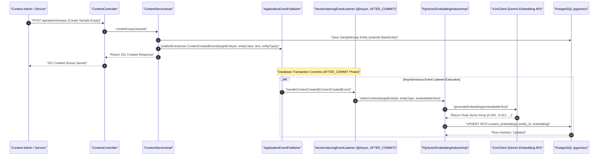
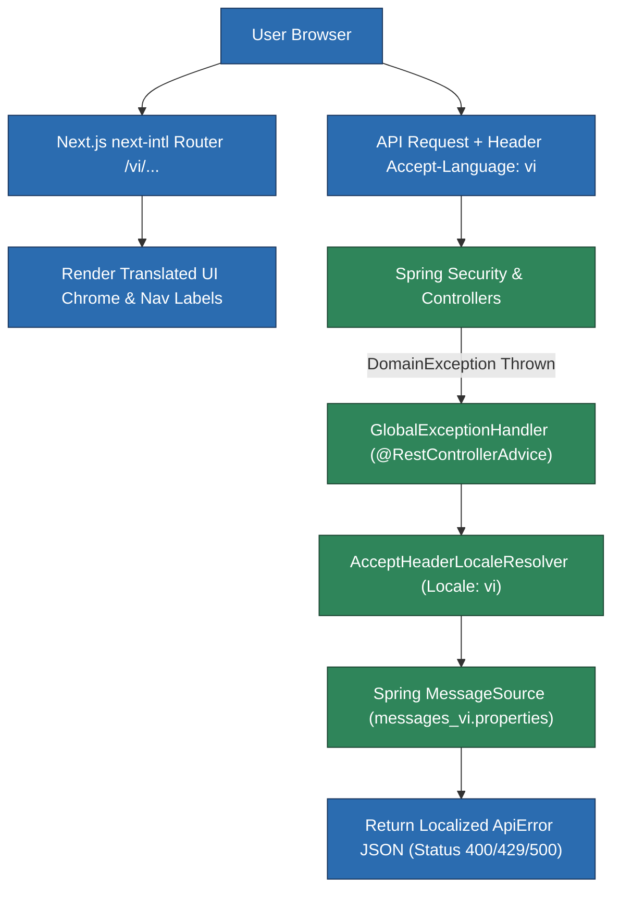
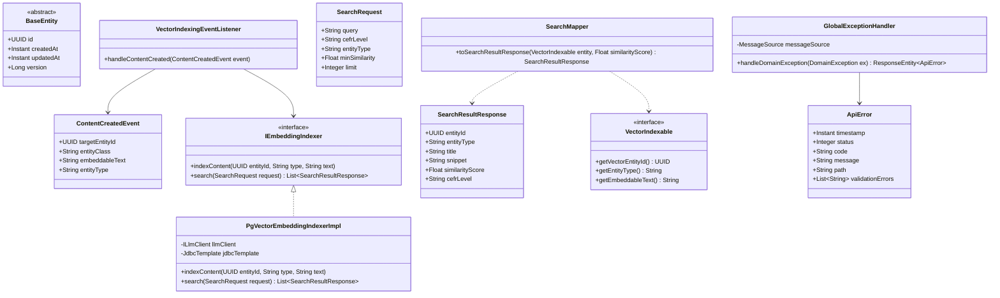

# User Flow & Technical Specifications: Semantic Search & Multilanguage Support

**Module Scope:** Requirements FR-13.1 through FR-15.3  
**Target Path:** `backend/feature-flows/11-semantic-search-and-i18n-flow.md`

---

## 1. Executive Summary & Architecture Alignment

This cross-cutting infrastructure module defines the system-wide standards for **Event-Driven Vector Search Indexing (Pattern 5)** and **Multilanguage Internationalization (i18n)**.

1. **Event-Driven Vector Indexing (Pattern 5)**: Standardizes natural-language vector search across all domain modules (Sample Essays, Reading Passages, Knowledge Base Articles, Writing Submissions). Indexable entities implement `VectorIndexable` and publish Spring `ContentCreatedEvent` application events carrying lightweight primitive payloads (`targetEntityId`, `entityClass`, `embeddableText`). The `@Async` `VectorIndexingEventListener` uses `@TransactionalEventListener(phase = TransactionPhase.AFTER_COMMIT)` to execute strictly after transaction commit. This eliminates database transaction race conditions and JPA `LazyInitializationException` risks across asynchronous thread boundaries, delegating embedding generation to `PgVectorEmbeddingIndexerImpl` (`IEmbeddingIndexer`) using `ILlmClient` (Google Gemini Embedding API) into PostgreSQL `pgvector`.
2. **Multilanguage & Error Localization Architecture**: Next.js `next-intl` provides frontend localization routing (`/en/...`, `/vi/...`, `/es/...`) for UI chrome and navigation elements. Learning content (passages, questions, essays) remains strictly in English to preserve IELTS test authenticity. Backend API errors parse the `Accept-Language` HTTP header, resolving localized messages via Spring `MessageSource` (`messages_{locale}.properties`) inside `@RestControllerAdvice` (`GlobalExceptionHandler`), returning standardized `ApiError` JSON responses.

---

## 2. Component Reusability Patterns & Infrastructure Contracts

### Reusability Pattern 5: Event-Driven Vector Search Indexing
All searchable domain entities implement `VectorIndexable` and publish `ContentCreatedEvent` upon persistence. The asynchronous event listener `VectorIndexingEventListener` handles embedding creation after transaction commit (`AFTER_COMMIT`), utilizing `PgVectorEmbeddingIndexerImpl`.

---

## 3. Package & File Structure

The module strictly follows the 7-folder package layout standard across `com.ieltsplatform.common` and `com.ieltsplatform.modules.search`:

```
backend/src/main/java/com/ieltsplatform/common/
├── base/
│   ├── BaseEntity.java
│   └── VectorIndexable.java
├── controllers/
│   └── SearchController.java
├── dtos/
│   ├── SearchRequest.java
│   ├── SearchResultResponse.java
│   └── ApiError.java
├── entities/
│   └── ContentEmbedding.java
├── events/
│   └── ContentCreatedEvent.java
├── exceptions/
│   ├── DomainException.java
│   └── GlobalExceptionHandler.java
├── i18n/
│   └── I18nConfig.java
├── listeners/
│   └── VectorIndexingEventListener.java
├── mapper/
│   └── SearchMapper.java
├── ports/
│   ├── IEmbeddingIndexer.java
│   └── ILlmClient.java
├── repository/
│   └── ContentEmbeddingRepository.java
└── services/impl/
    ├── GeminiLlmClientImpl.java
    └── PgVectorEmbeddingIndexerImpl.java
```

---

## 4. Detailed Component Specifications

### 4.1 Shared Kernel Contracts & Entities

#### `BaseEntity.java`
- Abstract base class for all JPA `@Entity` classes in the system.
- **Fields**:
  - `id`: `UUID` (`@Id`, `@GeneratedValue(strategy = GenerationType.UUID)`)
  - `createdAt`: `Instant` (`@CreatedDate`, `@Column(updatable = false)`)
  - `updatedAt`: `Instant` (`@LastModifiedDate`)
  - `version`: `Long` (`@Version`, optimistic locking count)

#### `VectorIndexable.java`
- Interface implemented by searchable domain entities (`SampleEssay`, `KnowledgeBaseArticle`, `ReadingPassage`, `EssaySubmission`).
- **Methods**:
  - `getVectorEntityId()`: Returns `UUID` primary key.
  - `getEntityType()`: Returns String entity discriminator (e.g., `"SAMPLE_ESSAY"`, `"KNOWLEDGE_BASE"`).
  - `getEmbeddableText()`: Returns normalized text representation for vector embedding.

#### `ContentEmbedding.java`
```java
@Entity
@Table(name = "content_embeddings")
public class ContentEmbedding extends BaseEntity {

    @Column(name = "entity_id", nullable = false)
    private UUID entityId;

    @Column(name = "entity_type", nullable = false, length = 50)
    private String entityType;

    @Column(name = "embedding", columnDefinition = "vector(768)", nullable = false)
    private String embedding;

    // Getters, setters, constructors
}
```

#### `ContentCreatedEvent.java`
- Spring `ApplicationEvent` published upon entity persistence or update.
- **Payload Fields**:
  - `targetEntityId`: `UUID`
  - `entityClass`: `String` (e.g., `"com.ieltsplatform.modules.content.entities.SampleEssay"`)
  - `embeddableText`: `String`
  - `entityType`: `String`

#### `VectorIndexingEventListener.java`
- `@Component` containing event handler:
  ```java
  @Async
  @TransactionalEventListener(phase = TransactionPhase.AFTER_COMMIT)
  public void handleContentCreated(ContentCreatedEvent event) {
      indexer.indexContent(
          event.getTargetEntityId(),
          event.getEntityType(),
          event.getEmbeddableText()
      );
  }
  ```

### 4.2 Data Transfer Objects (DTOs)

#### `SearchRequest.java`
```java
public record SearchRequest(
    String query,
    String cefrLevel,
    String entityType,
    Float minSimilarity,
    Integer limit
) {
    public SearchRequest {
        if (limit == null || limit <= 0) {
            limit = 10;
        }
        if (minSimilarity == null) {
            minSimilarity = 0.60f;
        }
    }
}
```

#### `SearchResultResponse.java`
```java
public record SearchResultResponse(
    UUID entityId,
    String entityType,
    String title,
    String snippet,
    Float similarityScore,
    String cefrLevel
) {}
```

### 4.3 Static Utility Mapper (`SearchMapper.java`)

```java
public final class SearchMapper {

    private SearchMapper() {}

    public static SearchResultResponse toSearchResultResponse(VectorIndexable entity, Float similarityScore) {
        if (entity == null) return null;
        String text = entity.getEmbeddableText();
        String snippet = (text != null && text.length() > 150) ? text.substring(0, 150) + "..." : text;
        return new SearchResultResponse(
            UUID.fromString(entity.getVectorEntityId()),
            entity.getEntityType(),
            entity.getEntityType() + " Item",
            snippet,
            similarityScore,
            "B2"
        );
    }
}
```

### 4.4 Repository & Controller Interfaces

#### `ContentEmbeddingRepository.java`
```java
@Repository
public interface ContentEmbeddingRepository extends JpaRepository<ContentEmbedding, UUID> {
    
    @Query(value = "SELECT entity_id, entity_type, (1 - (embedding <=> :queryVector)) AS score " +
                   "FROM content_embeddings " +
                   "WHERE (1 - (embedding <=> :queryVector)) >= :minSimilarity " +
                   "ORDER BY embedding <=> :queryVector LIMIT :limit", nativeQuery = true)
    List<Object[]> searchSimilarContent(@Param("queryVector") String queryVector, 
                                        @Param("minSimilarity") Float minSimilarity, 
                                        @Param("limit") Integer limit);
}
```

#### `SearchController.java`
```java
@RestController
@RequestMapping("/api/search")
public class SearchController {

    private final IEmbeddingIndexer indexer;

    public SearchController(IEmbeddingIndexer indexer) {
        this.indexer = indexer;
    }

    @PostMapping
    public ResponseEntity<List<SearchResultResponse>> search(@RequestBody SearchRequest request) {
        List<SearchResultResponse> results = indexer.search(request);
        return ResponseEntity.ok(results);
    }
}
```

---

## 5. Multilanguage (i18n) & Error Response Architecture

### Frontend Locale Routing (`next-intl`)
- Middleware handles locale detection and URL routing: `/en/dashboard`, `/vi/dashboard`, `/es/dashboard`.
- Renders localized UI labels, navigation menus, and buttons.
- Forwards user locale preference via `Accept-Language: vi-VN,vi;q=0.9,en;q=0.8` header on all API calls.

### Backend Error Localization Workflow
1. Client sends request with header: `Accept-Language: vi`.
2. `AcceptHeaderLocaleResolver` extracts target `Locale` (`Locale.forLanguageTag("vi")`).
3. When a domain rule fails, service throws `DomainException("ERR_EXCEED_DAILY_LIMIT", new Object[]{ cap })`.
4. `GlobalExceptionHandler` interceptor catches `DomainException`.
5. Resolves localized error template from Spring `MessageSource`:
   - `messages_vi.properties`: `ERR_EXCEED_DAILY_LIMIT=Bạn đã vượt quá giới hạn {0} lượt làm bài hàng ngày.`
   - `messages_en.properties`: `ERR_EXCEED_DAILY_LIMIT=You have exceeded your daily limit of {0} attempts.`
6. Formats and returns `ApiError` DTO:
   ```json
   {
     "timestamp": "2026-08-02T08:24:40Z",
     "status": 429,
     "code": "ERR_EXCEED_DAILY_LIMIT",
     "message": "Bạn đã vượt quá giới hạn 3 lượt làm bài hàng ngày.",
     "path": "/api/assessment/attempts",
     "validationErrors": null
   }
   ```

---

## 6. Step-by-Step User Flows

### Flow A: Event-Driven Vector Search Indexing Pipeline
1. **Admin / System Action:** Content Administrator inserts or updates a sample essay via `POST /api/admin/essays`.
2. **Entity Persistence & Event Publication:**
   - `SampleEssayServiceImpl` creates `SampleEssay` entity (extends `BaseEntity`, implements `VectorIndexable`) and saves to PostgreSQL.
   - `ApplicationEventPublisher.publishEvent(new ContentCreatedEvent(essay.getId(), essay.getClass().getName(), text, "SAMPLE_ESSAY"))` is triggered within active transaction.
3. **Transaction Commit & Async Trigger (`AFTER_COMMIT`):**
   - Active database transaction commits successfully.
   - Spring triggers `@TransactionalEventListener(phase = AFTER_COMMIT)` on `@Async` `VectorIndexingEventListener`.
4. **Vector Embedding Generation & Database Indexing:**
   - `VectorIndexingEventListener` calls `PgVectorEmbeddingIndexerImpl.indexContent(id, type, text)`.
   - `PgVectorEmbeddingIndexerImpl` calls `ILlmClient.generateEmbedding(text)` (Google Gemini Embedding API) returning a float vector.
   - Executes SQL update into PostgreSQL `pgvector` store:
     ```sql
     INSERT INTO content_embeddings (id, entity_id, entity_type, embedding, updated_at)
     VALUES (gen_random_uuid(), :entityId, :entityType, :embeddingVector, NOW())
     ON CONFLICT (entity_id) DO UPDATE SET embedding = EXCLUDED.embedding, updated_at = NOW();
     ```

### Flow B: Cross-Entity Hybrid Semantic Search Query
1. **User Action:** Enters search query at `/search`: *"sample essays discussing renewable energy pros and cons"*.
2. **API Request:** `POST /api/search` with `{ "query": "sample essays discussing renewable energy pros and cons", "limit": 10 }`.
3. **Backend Execution (`PgVectorEmbeddingIndexerImpl`):**
   - Invokes `ILlmClient.generateEmbedding(query)` to obtain vector representation.
   - Queries `content_embeddings` table using PostgreSQL `HNSW` cosine index:
     ```sql
     SELECT entity_id, entity_type, (1 - (embedding <=> :queryVector)) AS score
     FROM content_embeddings
     WHERE (1 - (embedding <=> :queryVector)) >= 0.65
     ORDER BY embedding <=> :queryVector
     LIMIT 10;
     ```
   - Fetches corresponding entity details from `SampleEssayRepository`, `KnowledgeBaseArticleRepository`, or `ReadingPassageRepository`.
   - Maps entity results to `SearchResultResponse` DTO list using static `SearchMapper.toSearchResultResponse(entity, score)`.
4. **Response:** Renders aggregated search results list with relevance similarity scores.

### Flow C: Multilanguage UI Switching & Localized Exception Handling
1. **User Action:** Switches language toggle to Vietnamese (`vi`).
2. **Frontend:** `next-intl` re-renders dashboard in Vietnamese and appends `Accept-Language: vi` to API requests.
3. **API Call Execution:** User attempts to submit an essay after reaching daily quota.
4. **Exception Resolution:** `GlobalExceptionHandler` intercepts `DomainException("ERR_EXCEED_DAILY_LIMIT", ...)`, fetches localized string from `messages_vi.properties`, and returns `429 Too Many Requests` response with localized Vietnamese message.

---

## 7. Visual Architecture & Sequence Diagrams

### Diagram 11.1: Event-Driven Vector Search Indexing Pipeline (Sequence Diagram)



---

### Diagram 11.2: Multilanguage & Global Exception Localization Architecture (Component Diagram)



---

### Diagram 11.3: Shared Kernel & Vector Indexing Domain Model (UML Class Diagram)


